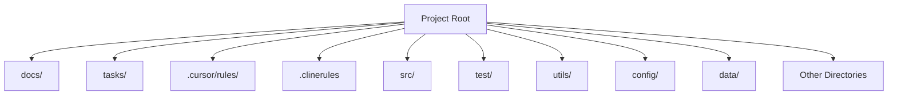

---
description: the top-level directory structure for the project
globs: 
alwaysApply: false
---     
# Directory Structure

```mermaid
flowchart TD
    Root[Project Root]
    Root --> Docs[docs/]
    Root --> Tasks[tasks/]
    Root --> Cursor[.cursor/rules/]
    Root --> CLINE[.clinerules]
    Root --> SourceCode[src/]
    Root --> Test[test/]
    Root --> Utils[utils/]
    Root --> Config[config/]
    Root --> Data[data/]
    Root --> Other[Other Directories]
```