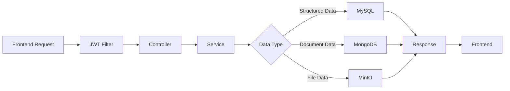

# 新闻头条项目CodeMap

## 🏗️ 系统架构CodeMap

### 整体架构层次

```mermaid
News_JavaWeb/
├── 📱 Frontend Layer (Vue 3 + Element UI)
├── 🌐 API Gateway Layer (Spring MVC)
├── 🔧 Controller Layer (13 REST Controllers)
├── 💼 Service Layer (15 Business Services)
├── 🗄️ Data Access Layer (MyBatis + MongoRepository)
├── 💾 Multi-Data Source (MySQL + MongoDB + MinIO)
└── 🔒 Security Layer (JWT + Spring Security)
```

## 📊 数据流CodeMap

### 多数据源架构流



### 核心业务流程

```text
🔐 Authentication Flow:
Login → AuthController → UserService → UserMapper → MySQL(users)
      ↓
JWT Token ← JwtUtil ← User Validation ← BCrypt Verify

📰 News Management Flow:
Create News → HeadlineController → HeadlineService → Dual Storage
      ↓                ↓                  ↓              ↓
Rich Content → News Metadata → MySQL(headlines) + MongoDB(news)
      ↓                ↓                  ↓              ↓
Cover Image → File Upload → MinIO Storage → MongoDB(file_metadata)

💬 Comment Flow:
Post Comment → CommentController → CommentService → MongoDB(comments)
      ↓              ↓                ↓              ↓
Media Attach → File Upload → MinIO Storage → Comment Enhancement
```

## 🗂️ 模块结构CodeMap

### Controller层模块映射

```mermaid
🎯 API Controllers (/api/v1/)
├── 🔐 AuthController          → /auth/* (登录、注册、Token管理)
├── 👥 UserController          → /users/* (用户CRUD、权限管理)
├── 📰 HeadlineController      → /headlines/* (新闻发布、查询、更新)
├── 📂 NewsTypeController      → /categories/* (新闻分类管理)
├── 💬 CommentController       → /comments/* (评论CRUD和审核)
├── ⭐ FavoriteController      → /favorites/* (用户收藏管理)
├── 📁 FileController          → /common/upload (文件上传下载)
├── 📊 StatisticsController    → /statistics/* (数据统计和报表)
├── 👨‍💼 AdminController          → /admin/* (管理员功能)
├── 🔧 CommonController        → /common/* (通用功能)
└── 💓 HealthController        → /health/* (健康检查)
```

### Service层业务逻辑映射

```mermaid
💼 Business Logic Services
├── 👤 UserService             → 用户认证、信息管理、权限验证
├── 📰 HeadlineService         → 新闻业务逻辑、发布流程、状态管理
├── 💬 CommentService          → 评论业务逻辑、审核机制、回复处理
├── ⭐ FavoriteService         → 收藏业务逻辑、批量操作、状态管理
├── 📁 FileService             → 文件业务逻辑、上传下载、权限控制
├── 📊 StatisticsService       → 统计业务逻辑、数据分析、报表生成
├── 🔐 RoleService             → 角色权限业务、RBAC管理
├── 📂 NewsTypeService         → 新闻分类业务、层级管理
├── 🗄️ MinioFileService        → MinIO存储服务、对象操作
├── 📝 OperationLogService    → 操作日志服务、审计追踪
├── ⚙️ SystemConfigService     → 系统配置服务、参数管理
├── 💓 HealthCheckService      → 健康检查服务、系统监控
├── 🔗 UserRoleService         → 用户角色关联服务
└── 🔄 FavoriteServiceExtended → 扩展收藏服务、高级功能
```

## 🗄️ 数据库结构CodeMap

### MySQL数据表映射

```mermaid
💾 MySQL Database (news_db)
├── 👥 用户认证体系
│   ├── users (id, username, password, email, phone, avatar_url, status, last_login_time, created_time, updated_time)
│   ├── roles (id, role_name, description, status, created_time, updated_time)
│   └── user_roles (id, user_id, role_id, created_time)
│
├── 📰 新闻核心数据
│   ├── headlines (hid, title, content, cover_image_url, type, publisher, source, tags, summary, page_views, like_count, comment_count, favorite_count, is_top, is_hot, status, published_time, created_time, updated_time)
│   ├── news_types (tid, tname, description, icon_url, sort_order, status, created_time, updated_time)
│   └── news_statistics (id, news_id, statistic_date, daily_views, weekly_views, monthly_views, total_views, daily_likes, weekly_likes, monthly_likes, total_likes, daily_comments, weekly_comments, monthly_comments, total_comments, daily_favorites, weekly_favorites, monthly_favorites, total_favorites, created_time, updated_time)
│
├── 💬 互动数据
│   ├── comments (cid, hid, user_id, parent_id, content, like_count, status, created_time, updated_time)
│   └── favorites (id, hid, user_id, favorite_time)
│
└── ⚙️ 系统配置
    └── system_config (id, config_key, config_value, config_type, description, is_system, created_time, updated_time)
```

### MongoDB集合映射

```mermaid
📋 MongoDB Database (News_MongoDB)
├── 📰 新闻内容集合
│   └── news (_id, news_id, title, content, summary, cover_image, keywords, content_type, word_count, reading_time, tags, author_info, seo_info, status, created_at, updated_at)
│
├── 💬 评论集合
│   └── comments (_id, news_id, user_id, parent_id, content, like_count, reply_count, is_deleted, is_pinned, user_info, mentions, media, location, device_info, status, created_at, updated_at)
│
├── 📁 文件元数据集合
│   └── file_metadata (_id, file_id, original_name, file_name, file_path, file_size, file_type, mime_type, uploader_id, related_type, related_id, usage_type, bucket_name, access_url, thumbnail_url, status, created_at, updated_at)
│
├── 👤 用户行为集合
│   └── user_behavior (_id, user_id, session_id, behavior_type, target_type, target_id, metadata, device_info, location, created_at)
│
└── 💾 系统缓存集合
    └── system_cache (_id, cache_key, cache_value, cache_type, expire_time, created_at, updated_at)
```

### MinIO存储结构映射

```mermaid
🗂️ MinIO Object Storage (news-storage/)
├── 🖼️ images/
│   ├── news/           # 新闻图片
│   ├── avatars/        # 用户头像
│   └── thumbnails/     # 缩略图
├── 🎥 videos/
│   └── news/           # 新闻视频
├── 📄 documents/
│   └── attachments/    # 附件资料
└── 📦 temp/            # 临时文件
```

## 🔗 数据关系CodeMap

### 跨库关联映射

```mermaid
🔗 Cross-Database Relationships
MySQL ↔ MongoDB ↔ MinIO

📰 新闻数据关联:
MySQL.headlines.hid ←→ MongoDB.news.news_id ←→ MinIO.news-storage/images/news/

👥 用户数据关联:
MySQL.users.id ←→ MongoDB.comments.user_id ←→ MongoDB.user_behavior.user_id ←→ MinIO.news-storage/images/avatars/

💬 评论数据关联:
MySQL.headlines.hid ←→ MongoDB.comments.news_id ←→ MinIO.news-storage/images/comments/

📁 文件数据关联:
MongoDB.file_metadata.related_id ←→ MySQL.headlines.hid ←→ MinIO.news-storage/
```

### 数据一致性策略

```mermaid
🔄 Data Consistency Strategy

🔒 Strong Consistency (MySQL):
- User authentication and authorization
- Role-based access control
- News core metadata
- System configuration
- Statistical counters

🌊 Eventual Consistency (MongoDB):
- News rich content
- Comment threads and replies
- File metadata and relationships
- User behavior analytics
- System cache data

📁 File Data (MinIO):
- Binary file storage
- Access through metadata association
- CDN distribution support
```

## 🛡️ 安全架构CodeMap

### JWT认证流程

```mermaid
🔐 JWT Authentication Flow
User Login → AuthController → UserService → UserMapper → MySQL(users)
      ↓              ↓                ↓              ↓          ↓
JWT Token ← JwtUtil ← User Validation ← Password Check ← BCrypt Verify
      ↓
API Request → JwtAuthenticationFilter → SecurityConfig → Spring Security
      ↓              ↓                      ↓              ↓
Token Valid → User Context → Permission Check → Business Logic
```

### RBAC权限模型

```mermaid
👥 RBAC Permission Model
Users ←→ UserRoles ←→ Roles ←→ Permissions

🔑 Permission Types:
- news:read      (新闻查看)
- news:create    (新闻创建)
- news:update    (新闻编辑)
- news:delete    (新闻删除)
- user:manage    (用户管理)
- system:config  (系统配置)
- admin:all      (管理员权限)

🎭 Role Definitions:
- 普通用户: news:read
- 编辑: news:read, news:create, news:update
- 管理员: news:read, news:create, news:update, news:delete, user:manage
- 超级管理员: admin:all
```

## 🚀 性能优化CodeMap

### 缓存策略映射

```mermaid
💾 Caching Strategy (Planned Redis Integration)

🔥 Hot Data Cache:
- User permissions (30min TTL)
- Hot news list (5min TTL)
- News categories (1hour TTL)
- System configuration (manual refresh)

📊 Statistics Cache:
- Daily view counts
- User activity metrics
- Popular content rankings
- System health indicators

🔍 Search Cache:
- Search results (10min TTL)
- Popular search terms
- Auto-complete suggestions
- Category-based recommendations
```

### 数据库优化映射

```mermaid
⚡ Database Optimization

🗄️ MySQL Optimization:
- Primary key indexes on id/hid/tid/cid
- Composite indexes on (user_id, created_time)
- Foreign key constraints for data integrity
- Query optimization with proper JOIN strategies

📋 MongoDB Optimization:
- Compound indexes on (news_id, created_at)
- Text search indexes on (title, content, summary)
- TTL indexes for automatic cleanup (90 days)
- Aggregation pipeline optimization

🗂️ MinIO Optimization:
- Multi-replica storage for redundancy
- CDN integration for global distribution
- Image compression and format conversion
- Pre-loading strategies for critical assets
```

## 📈 扩展性CodeMap

### 微服务化路径

```mermaid
🔄 Microservices Migration Path

Current Monolith → Future Microservices

🎯 Service Boundaries:
├── User Service (用户管理、认证授权)
├── News Service (新闻管理、内容发布)
├── File Service (文件管理、对象存储)
├── Comment Service (评论系统、互动功能)
├── Statistics Service (统计分析、数据报表)
└── Gateway Service (API网关、路由转发)

🔗 Service Communication:
- Synchronous: HTTP RESTful API calls
- Asynchronous: Message queue events
- Service Discovery: Eureka/Consul
- Configuration Center: Spring Cloud Config
```

### 云原生部署

```mermaid
☁️ Cloud-Native Deployment

🐳 Container Strategy:
- Spring Boot application container
- MySQL database container
- MongoDB database container
- MinIO storage container
- Nginx reverse proxy container

☸️ Kubernetes Orchestration:
- Pod auto-scaling based on load
- Service mesh with Istio
- ConfigMap and Secret management
- Persistent volume claims for data storage

📊 Monitoring Stack:
- Prometheus metrics collection
- Grafana dashboard visualization
- ELK stack for log aggregation
- AlertManager for notification
```

## 🔧 开发工作流CodeMap

### 代码组织结构

```mermaid
📁 Source Code Organization
News_SpringBoot/src/main/java/com/zhouyi/
├── 🎯 NewsSpringBootApplication.java (主启动类)
├── 🎮 controller/ (13个REST控制器)
├── 💼 service/ (15个业务服务 + impl实现)
├── 🗄️ mapper/ (MyBatis数据访问接口)
├── 📋 entity/ (MySQL实体类)
├── 📄 entity/mongodb/ (MongoDB文档类)
├── 📦 dto/ (数据传输对象)
├── 🔧 config/ (5个配置类)
├── 🛡️ common/ (通用组件)
│   ├── exception/ (异常处理)
│   ├── filter/ (JWT过滤器)
│   ├── result/ (统一响应格式)
│   └── utils/ (工具类)
└── 📝 resources/ (配置文件、Mapper XML)
```

### API端点映射

```mermaid
🌐 RESTful API Endpoints

🔐 Authentication (/api/v1/auth):
- POST /login        (用户登录)
- POST /register     (用户注册)
- POST /validate     (Token验证)
- POST /refresh      (Token刷新)
- POST /logout       (用户登出)

👥 Users (/api/v1/users):
- GET  /             (用户列表)
- GET  /{id}         (用户详情)
- GET  /profile      (当前用户信息)
- POST /             (创建用户)
- PUT  /{id}         (更新用户)
- DELETE /{id}       (删除用户)

📰 News (/api/v1/headlines):
- GET  /             (新闻列表)
- GET  /{id}         (新闻详情)
- POST /             (创建新闻)
- PUT  /{id}         (更新新闻)
- DELETE /{id}       (删除新闻)
- PUT  /{id}/publish (发布新闻)
- PUT  /{id}/offline (下线新闻)

📁 Files (/api/v1/common):
- POST /upload       (文件上传)
- GET  /files/{path} (文件访问)

📊 Statistics (/api/v1/statistics):
- GET  /overview     (系统概览)
- GET  /news         (新闻统计)
- GET  /users        (用户统计)
- GET  /performance  (性能统计)
```

## 🎯 质量保证CodeMap

### 测试策略映射

```mermaid
🧪 Testing Strategy

🔬 Unit Tests:
- Service layer business logic tests
- Utility class functionality tests
- Data validation tests
- Security mechanism tests

🔗 Integration Tests:
- Database integration tests
- API endpoint tests
- File upload/download tests
- Cross-database consistency tests

🌐 End-to-End Tests:
- User authentication flow
- News publishing workflow
- File management process
- Statistics generation

⚡ Performance Tests:
- Load testing for concurrent users
- Stress testing for peak loads
- Database query performance
- File upload/download speed
```

### 监控告警映射

```mermaid
📊 Monitoring & Alerting

🔍 Application Monitoring:
- API response time metrics
- Error rate tracking
- Throughput measurement
- Resource usage monitoring

🗄️ Database Monitoring:
- MySQL query performance
- MongoDB operation metrics
- Connection pool status
- Storage utilization

📁 File Storage Monitoring:
- MinIO service health
- Storage capacity tracking
- Upload/download statistics
- CDN performance metrics

🚨 Alerting Rules:
- High error rate alerts
- Performance degradation alerts
- Storage capacity warnings
- Service availability alerts
```

## 📋 部署架构CodeMap

### 环境配置映射

```mermaid
🌍 Environment Configuration

🏠 Development Environment:
- Single machine deployment
- Local MySQL/MongoDB/MinIO
- Hot reload enabled
- Debug logging level

🧪 Testing Environment:
- Containerized deployment
- Automated database seeding
- Integration test execution
- Performance benchmarking

🚀 Production Environment:
- Cluster deployment with load balancer
- High availability database setup
- Distributed MinIO configuration
- Comprehensive monitoring stack

☁️ Cloud Environment:
- Kubernetes orchestration
- Managed database services
- CDN integration
- Auto-scaling configuration
```

### 数据备份策略

```mermaid
💾 Backup & Recovery Strategy

🗄️ MySQL Backup:
- Daily full database backup
- Real-time binary log backup
- Point-in-time recovery capability
- Cross-region backup replication

📋 MongoDB Backup:
- Daily snapshot backup
- Oplog backup for point-in-time recovery
- Replica set for high availability
- Automated backup verification

📁 MinIO Backup:
- Multi-replica storage configuration
- Cross-region data replication
- Versioned object storage
- Automated integrity checks

🔄 Disaster Recovery:
- Automated failover procedures
- Data consistency verification
- Service restoration workflows
- Recovery time objectives (RTO/RPO)
```

---

## 🎯 总结

这个CodeMap提供了新闻头条项目的完整技术架构视图，涵盖了从系统架构到部署运维的各个层面。通过这个映射，开发团队可以快速理解项目结构，定位问题，并进行有效的系统维护和扩展。

**关键特性**:

- 🏗️ 清晰的分层架构设计
- 🗄️ 合理的多数据源分布
- 🔐 完善的安全认证机制
- 🚀 良好的扩展性设计
- 📊 全面的监控体系

**技术优势**:

- 现代化技术栈 (Spring Boot 3.0 + Vue 3)
- 高性能数据库设计 (MySQL + MongoDB + MinIO)
- 完整的RESTful API规范
- 容器化部署支持
- 微服务化演进路径

这个CodeMap将作为项目技术文档的核心组成部分，为团队协作和系统维护提供重要参考。
