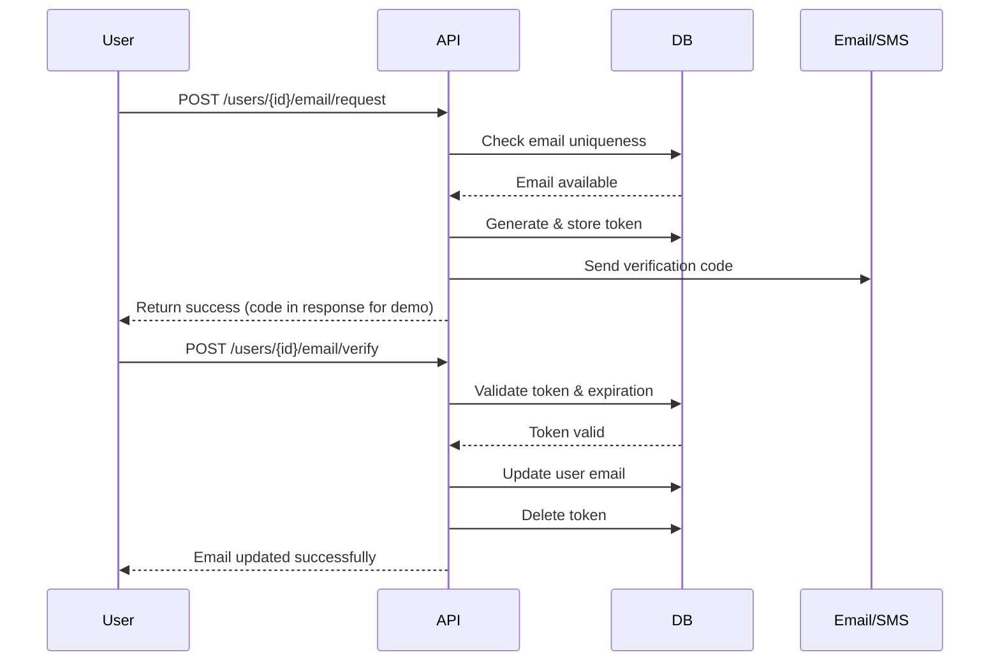

# 新闻头条项目 (News Headline) API 接口文档

## 1. 概述

本项目基于 Spring Boot + MyBatis + MySQL + MongoDB + MinIO 开发，前端对接 Vue + Element
UI。采用多数据源架构，支持结构化数据、文档数据和对象存储。所有接口遵循 RESTful 风格规范，返回统一的 JSON 响应格式。

### 1.1 基础信息

- **当前版本**: v4.8
- **服务器地址**: `http://localhost:8080`
- **API 基础路径**: `/api/v1`
- **前端技术栈**: Vue 3 + Element UI
- **后端技术栈**: Spring Boot 3.0.2 + MyBatis 3.0 + MySQL 8.0+ + MongoDB 5.0+ + MinIO 8.5.13
- **JDK 版本**: Java 17
- **构建工具**: Maven 3.6+
- **未来扩展**: ElasticSearch（全文搜索）
- **架构模式**: 分层架构 (Controller-Service-DAO) + 多数据源架构

### 1.2 项目状态

#### 已完成模块

- ✅ **用户管理**: 注册、登录、信息更新、头像管理、密码修改
- ✅ **认证授权**: JWT 认证、Token 刷新、权限控制、RBAC 角色管理
- ✅ **新闻头条**: 完整 CRUD、分页查询、状态管理、浏览统计
- ✅ **分类管理**: 分类 CRUD、状态管理、统计功能
- ✅ **评论系统**: 评论 CRUD、点赞功能、回复功能
- ✅ **收藏功能**: 收藏管理、批量操作、分类管理
- ✅ **统计分析**: 系统概览、新闻统计、用户统计、评论统计、收藏统计、文件统计
- ✅ **文件管理**: 文件上传、删除、存储管理
- ✅ **系统管理**: 配置管理、操作日志、系统监控
- 🚧 **实时新闻**: 外部新闻 API 集成、自动新闻采集、RSS 订阅管理
- 🚧 **短信验证**: 手机号验证码注册登录、短信网关集成、短信认证
- 🚧 **邮箱验证**: 邮箱验证码注册登录、邮件服务集成、邮箱认证

#### 代码质量改进

- ✅ **字段命名统一**: 解决 hid vs id 不一致问题
- ✅ **代码清理**: 移除未使用的导入，提升代码整洁度
- ✅ **响应格式统一**: 添加 timestamp 和 path 字段
- ✅ **Token 机制完善**: 实现完整的 Token 刷新机制

### 1.3 统一响应格式

所有接口均返回 `Result` 对象：

```json
{
  "code": 200, // 状态码：200成功，400+客户端错误，500+服务器错误
  "message": "success", // 提示信息
  "data": {}, // 业务数据
  "timestamp": "2025-11-25T12:00:00Z", // 响应时间戳（ISO 8601格式）
  "path": "/api/v1/users" // 请求路径（可选）
}
```

**响应状态码说明**：

- `200` - 请求成功
- `201` - 创建成功
- `400` - 请求参数错误
- `401` - 未授权访问
- `403` - 权限不足
- `404` - 资源不存在
- `409` - 资源冲突
- `422` - 数据验证失败
- `500` - 服务器内部错误

### 1.4 认证方式

- **Token 认证**: 部分接口需要在请求头中携带 JWT token
- **请求头格式**: `Authorization: Bearer {jwt_token}`

#### Token 获取

用户成功登录后，系统会生成 JWT token，客户端需要在后续请求中携带该 token。

#### Token 使用

```bash
# 使用Authorization Bearer头
curl -H "Authorization: Bearer your_jwt_token" http://localhost:8080/api/v1/users
```

#### Token 管理

- **验证 token**: `POST /api/v1/auth/validate`
- **刷新 token**: `POST /api/v1/auth/refresh`
- **获取当前用户**: `GET /api/v1/auth/me`
- **登出**: `POST /api/v1/auth/logout`

### 1.5 数据存储架构

本项目采用多数据源架构，根据数据特性选择合适的存储方案：

#### 1.5.1 MySQL 数据库

存储系统中的结构化数据，具有强事务相关性：

- **用户管理**: 用户基本信息、认证信息、角色权限关联
- **角色权限**: 角色定义、权限分配、用户角色关联
- **新闻核心**: 新闻基础信息、分类管理、统计数据
- **收藏管理**: 用户收藏关系数据
- **系统配置**: 应用配置、参数设置

**数据表结构**：

- `users` - 用户基础信息
- `roles` - 角色定义
- `user_roles` - 用户角色关联
- `news_types` - 新闻类别
- `headlines` - 新闻头条基础信息
- `favorites` - 收藏关系
- `system_config` - 系统配置
- `news_statistics` - 新闻统计数据

#### 1.5.2 MongoDB 数据库

存储系统中的非结构化数据，事务相关性较弱：

- **新闻内容**: 新闻正文、富文本内容、SEO 信息、标签
- **评论数据**: 用户评论、回复内容、点赞信息、媒体附件
- **日志数据**: 操作日志、访问记录、性能监控
- **文件元数据**: 文件信息、上传记录、访问统计
- **用户行为**: 浏览记录、互动行为、偏好分析

**集合结构**：

- `news` - 新闻详细内容
- `comments` - 评论数据
- `operation_logs` - 操作日志
- `file_metadata` - 文件元数据
- `user_behavior` - 用户行为分析（可选）
- `system_cache` - 系统缓存（可选）

#### 1.5.3 MinIO 对象存储

存储文件类型的二进制数据：

- **图片文件**: 新闻封面图、用户头像、评论图片
- **视频文件**: 新闻视频、用户上传视频
- **文档文件**: 附件、导入导出文件
- **缩略图**: 自动生成的图片缩略图

**存储桶结构**：

- `news-storage/images/` - 新闻图片
- `news-storage/videos/` - 视频文件
- `news-storage/documents/` - 文档文件
- `news-storage/avatars/` - 用户头像
- `news-storage/thumbnails/` - 缩略图

#### 1.4.4 ElasticSearch 搜索引擎（规划中）

提供全文搜索和数据检索能力：

- **新闻搜索**: 基于新闻内容的全文检索
- **智能推荐**: 基于用户行为的内容推荐
- **数据分析**: 内容统计分析、热点追踪

#### 1.4.5 Redis 缓存（规划中）

提供高性能缓存服务：

- **用户会话**: 登录状态、权限信息
- **热点数据**: 热门新闻、推荐内容
- **API 限流**: 接口访问频率控制
- **临时数据**: 验证码、临时令牌

### 1.5 数据一致性策略

#### 1.5.1 数据分布原则

- **MySQL**: 存储需要强一致性的核心业务数据
- **MongoDB**: 存储可以容忍最终一致性的内容数据
- **MinIO**: 存储文件二进制数据，元数据存储在 MongoDB
- **跨库关联**: 通过 ID 进行关联，避免跨库事务

#### 1.5.2 数据同步机制

- **实时同步**: 关键业务数据通过应用层保证一致性
- **异步同步**: 统计数据通过定时任务同步更新
- **事件驱动**: 关键操作通过事件机制同步相关数据
- **补偿机制**: 提供数据修复和一致性检查工具

#### 1.5.3 备份和恢复

- **MySQL**: 每日全量备份 + 实时 binlog 备份
- **MongoDB**: 每日快照备份 + oplog 备份
- **MinIO**: 多副本存储 + 跨区域备份
- **恢复策略**: 分级恢复，优先恢复核心业务数据

## 2. 通用模块

### 2.1 图片/文件上传

**接口描述**: 用于上传新闻封面、用户头像等图片文件。

- **请求方法**: POST
- **请求 URL**: `/api/v1/common/upload`
- **Content-Type**: `multipart/form-data`
- **权限要求**: 需要 JWT token

**查询参数**:

| 参数名  | 类型   | 必填 | 描述     |
|------|------|----|--------|
| file | file | 是  | 图片文件对象 |

**响应示例**:

```json
{
  "code": 200,
  "message": "上传成功",
  "data": "http://localhost:8080/files/images/20231101_uuid.jpg",
  "timestamp": "2025-11-25T12:00:00Z",
  "path": "/api/v1/common/upload"
}
```

## 3. 用户管理模块

### 3.1 获取用户列表

**接口描述**: 分页获取用户列表，支持搜索和筛选。

- **请求方法**: GET
- **请求 URL**: `/api/v1/users`
- **权限要求**: 需要 JWT token + 管理员权限

**Headers**:

- `Authorization: Bearer {jwt_token}`

**查询参数**:

| 参数名        | 类型      | 必填 | 默认值          | 描述                                        |
|------------|---------|----|--------------|-------------------------------------------|
| keywords   | string  | 否  | -            | 搜索关键词（用户名、手机号、邮箱）                         |
| status     | integer | 否  | -            | 用户状态：0-禁用，1-正常                            |
| role_id    | integer | 否  | -            | 角色 ID 筛选                                  |
| page       | integer | 否  | 1            | 页码，从 1 开始                                 |
| page_size  | integer | 否  | 10           | 每页数量，最大 100                               |
| sort_by    | string  | 否  | created_time | 排序字段：created_time, updated_time, username |
| sort_order | string  | 否  | desc         | 排序方向：asc, desc                            |

**请求示例**:

```http
GET /api/v1/users?keywords=张三&status=1&page=1&page_size=10
```

**响应示例**:

```json
{
  "code": 200,
  "message": "success",
  "data": {
    "total": 50,
    "page": 1,
    "page_size": 10,
    "total_pages": 5,
    "items": [
      {
        "id": 1,
        "username": "张三",
        "phone": "13800138000",
        "email": "zhangsan@example.com",
        "avatar": "https://example.com/avatars/1.jpg",
        "status": 1,
        "role_id": 2,
        "role_name": "普通用户",
        "created_time": "2025-11-20T10:00:00Z",
        "updated_time": "2025-11-20T10:00:00Z",
        "last_login_time": "2025-11-25T09:30:00Z"
      }
    ]
  },
  "timestamp": "2025-11-25T12:00:00Z",
  "path": "/api/v1/users"
}
```

### 3.2 获取用户详情

**接口描述**: 根据用户 ID 获取用户详细信息。

- **请求方法**: GET
- **请求 URL**: `/api/v1/users/{id}`
- **权限要求**: 需要 JWT token + 管理员权限或本人权限

**Headers**:

- `Authorization: Bearer {jwt_token}`

**路径参数**:

| 参数名 | 类型      | 必填 | 描述    |
|-----|---------|----|-------|
| id  | integer | 是  | 用户 ID |

**响应示例**:

```json
{
  "code": 200,
  "message": "success",
  "data": {
    "id": 1,
    "username": "张三",
    "phone": "13800138000",
    "email": "zhangsan@example.com",
    "avatar": "https://example.com/avatars/1.jpg",
    "status": 1,
    "role_id": 2,
    "role_name": "普通用户",
    "created_time": "2025-11-20T10:00:00Z",
    "updated_time": "2025-11-20T10:00:00Z",
    "last_login_time": "2025-11-25T09:30:00Z"
  },
  "timestamp": "2025-11-25T12:00:00Z",
  "path": "/api/v1/users/1"
}
```

### 3.3 更新用户信息 (已弃用)

> [!WARNING]
> **此接口已弃用**：此接口允许同时修改用户个人信息和账号属性，存在安全风险。请使用以下新接口：
> - 用户更新个人资料：`PUT /api/v1/users/{id}/profile`
> - 管理员更新用户属性：`PUT /api/v1/users/{id}/admin`

**接口描述**: 更新用户信息（已弃用，仅为向后兼容保留）。

- **请求方法**: PUT
- **请求 URL**: `/api/v1/users/{id}`
- **权限要求**: 需要 JWT token + 管理员权限或本人权限

**Headers**:

- `Authorization: Bearer {jwt_token}`

**路径参数**:

| 参数名 | 类型      | 必填 | 描述    |
|-----|---------|----|-------|
| id  | integer | 是  | 用户 ID |

**请求体** (JSON):

```json
{
  "username": "更新后的用户名",
  "email": "updated@example.com",
  "role_id": 3,
  "status": 1
}
```

**响应示例**:

```json
{
  "code": 200,
  "message": "更新成功",
  "data": {
    "id": 1,
    "updated_time": "2025-11-25T12:30:00Z"
  },
  "timestamp": "2025-11-25T12:30:00Z",
  "path": "/api/v1/users/1"
}
```

### 3.3.1 更新用户个人资料

**接口描述**: 用户更新自己的个人资料（用户名和头像）。

- **请求方法**: PUT
- **请求 URL**: `/api/v1/users/{id}/profile`
- **权限要求**: 需要 JWT token，用户只能更新自己的资料

**Headers**:

- `Authorization: Bearer {jwt_token}`

**路径参数**:

| 参数名 | 类型      | 必填 | 描述    |
|-----|---------|----|-------|
| id  | integer | 是  | 用户 ID |

**请求体** (JSON):

```json
{
  "username": "新用户名",
  "avatar": "https://example.com/avatars/new-avatar.jpg"
}
```

**字段说明**:

| 字段名      | 类型     | 必填 | 描述                  |
|----------|--------|----|---------------------|
| username | string | 否  | 用户名，2-20字符，支持中英文和数字 |
| avatar   | string | 否  | 头像URL，最大500字符       |

**响应示例**:

```json
{
  "code": 200,
  "message": "Profile updated successfully",
  "data": null,
  "timestamp": "2025-11-25T12:30:00Z",
  "path": "/api/v1/users/1/profile"
}
```

**错误响应**:

```json
{
  "code": 403,
  "message": "无权修改其他用户的个人资料",
  "timestamp": "2025-11-25T12:30:00Z",
  "path": "/api/v1/users/2/profile"
}
```

### 3.3.2 更新用户属性（管理员）

**接口描述**: 管理员更新用户的账号属性（状态和角色）。

- **请求方法**: PUT
- **请求 URL**: `/api/v1/users/{id}/admin`
- **权限要求**: 需要 JWT token + 管理员权限

**Headers**:

- `Authorization: Bearer {jwt_token}`

**路径参数**:

| 参数名 | 类型      | 必填 | 描述    |
|-----|---------|----|-------|
| id  | integer | 是  | 用户 ID |

**请求体** (JSON):

```json
{
  "status": 1,
  "roleId": 2
}
```

**字段说明**:

| 字段名    | 类型      | 必填 | 描述                |
|--------|---------|----|-------------------|
| status | integer | 是  | 用户状态：0-禁用，1-启用    |
| roleId | integer | 否  | 角色ID：1-管理员，2-普通用户 |

**响应示例**:

```json
{
  "code": 200,
  "message": "User attributes updated successfully",
  "data": null,
  "timestamp": "2025-11-25T12:30:00Z",
  "path": "/api/v1/users/1/admin"
}
```

**错误响应**:

```json
{
  "code": 403,
  "message": "Access Denied",
  "timestamp": "2025-11-25T12:30:00Z",
  "path": "/api/v1/users/1/admin"
}
```

### 3.3.3 请求邮箱更新

**接口描述**: 用户请求更新邮箱，系统生成验证码。

- **请求方法**: POST
- **请求 URL**: `/api/v1/users/{id}/email/request`
- **权限要求**: 需要 JWT token，用户只能更新自己的邮箱

**Headers**:

- `Authorization: Bearer {jwt_token}`

**路径参数**:

| 参数名 | 类型      | 必填 | 描述    |
|-----|---------|----|-------|
| id  | integer | 是  | 用户 ID |

**请求体** (JSON):

```json
{
  "newEmail": "newemail@example.com"
}
```

**字段说明**:

| 字段名      | 类型     | 必填 | 描述    |
|----------|--------|----|-------|
| newEmail | string | 是  | 新邮箱地址 |

**响应示例**:

```json
{
  "code": 200,
  "message": "Verification code sent. Code: 123456 (expires in 15 minutes)",
  "data": "123456",
  "timestamp": "2025-11-25T12:30:00Z",
  "path": "/api/v1/users/1/email/request"
}
```

> [!NOTE]
> 验证码有效期为15分钟。在生产环境中，验证码应通过邮件发送，不应在响应中返回。

**错误响应**:

```json
{
  "code": 400,
  "message": "Email already in use by another user",
  "timestamp": "2025-11-25T12:30:00Z",
  "path": "/api/v1/users/1/email/request"
}
```

### 3.3.4 验证并更新邮箱

**接口描述**: 用户提交验证码，验证通过后更新邮箱。

- **请求方法**: POST
- **请求 URL**: `/api/v1/users/{id}/email/verify`
- **权限要求**: 需要 JWT token，用户只能验证自己的邮箱

**Headers**:

- `Authorization: Bearer {jwt_token}`

**路径参数**:

| 参数名 | 类型      | 必填 | 描述    |
|-----|---------|----|-------|
| id  | integer | 是  | 用户 ID |

**请求体** (JSON):

```json
{
  "token": "123456"
}
```

**字段说明**:

| 字段名   | 类型     | 必填 | 描述      |
|-------|--------|----|---------|
| token | string | 是  | 6位数字验证码 |

**响应示例**:

```json
{
  "code": 200,
  "message": "Email updated successfully",
  "data": null,
  "timestamp": "2025-11-25T12:30:00Z",
  "path": "/api/v1/users/1/email/verify"
}
```

**错误响应**:

```json
{
  "code": 400,
  "message": "Verification code has expired",
  "timestamp": "2025-11-25T12:30:00Z",
  "path": "/api/v1/users/1/email/verify"
}
```

### 3.3.5 请求手机号更新

**接口描述**: 用户请求更新手机号，系统生成验证码。

- **请求方法**: POST
- **请求 URL**: `/api/v1/users/{id}/phone/request`
- **权限要求**: 需要 JWT token，用户只能更新自己的手机号

**Headers**:

- `Authorization: Bearer {jwt_token}`

**路径参数**:

| 参数名 | 类型      | 必填 | 描述    |
|-----|---------|----|-------|
| id  | integer | 是  | 用户 ID |

**请求体** (JSON):

```json
{
  "newPhone": "13900139000"
}
```

**字段说明**:

| 字段名      | 类型     | 必填 | 描述         |
|----------|--------|----|------------|
| newPhone | string | 是  | 新手机号，11位数字 |

**响应示例**:

```json
{
  "code": 200,
  "message": "Verification code sent. Code: 654321 (expires in 15 minutes)",
  "data": "654321",
  "timestamp": "2025-11-25T12:30:00Z",
  "path": "/api/v1/users/1/phone/request"
}
```

> [!NOTE]
> 验证码有效期为15分钟。在生产环境中，验证码应通过短信发送，不应在响应中返回。

**错误响应**:

```json
{
  "code": 400,
  "message": "Phone number already in use by another user",
  "timestamp": "2025-11-25T12:30:00Z",
  "path": "/api/v1/users/1/phone/request"
}
```

### 3.3.6 验证并更新手机号

**接口描述**: 用户提交验证码，验证通过后更新手机号。

- **请求方法**: POST
- **请求 URL**: `/api/v1/users/{id}/phone/verify`
- **权限要求**: 需要 JWT token，用户只能验证自己的手机号

**Headers**:

- `Authorization: Bearer {jwt_token}`

**路径参数**:

| 参数名 | 类型      | 必填 | 描述    |
|-----|---------|----|-------|
| id  | integer | 是  | 用户 ID |

**请求体** (JSON):

```json
{
  "token": "654321"
}
```

**字段说明**:

| 字段名   | 类型     | 必填 | 描述      |
|-------|--------|----|---------|
| token | string | 是  | 6位数字验证码 |

**响应示例**:

```json
{
  "code": 200,
  "message": "Phone number updated successfully",
  "data": null,
  "timestamp": "2025-11-25T12:30:00Z",
  "path": "/api/v1/users/1/phone/verify"
}
```

**错误响应**:

```json
{
  "code": 400,
  "message": "Invalid verification code",
  "timestamp": "2025-11-25T12:30:00Z",
  "path": "/api/v1/users/1/phone/verify"
}
```

### 3.3.7 邮箱/手机号验证流程



### 3.4 删除用户

**接口描述**: 删除用户。

- **请求方法**: DELETE
- **请求 URL**: `/api/v1/users/{id}`
- **权限要求**: 需要 JWT token + 管理员权限

**Headers**:

- `Authorization: Bearer {jwt_token}`

**路径参数**:

| 参数名 | 类型      | 必填 | 描述    |
|-----|---------|----|-------|
| id  | integer | 是  | 用户 ID |

**响应示例**:

```json
{
  "code": 200,
  "message": "删除成功",
  "data": {
    "id": 1,
    "deleted_time": "2025-11-25T12:30:00Z"
  },
  "timestamp": "2025-11-25T12:30:00Z",
  "path": "/api/v1/users/1"
}
```

## 4. 认证模块

### 4.1 用户登录

**接口描述**: 根据手机号和密码进行登录认证。

- **请求方法**: POST
- **请求 URL**: `/api/v1/auth/login`
- **权限要求**: 无需认证

**请求体** (JSON):

```json
{
  "phone": "13800138000",
  "password": "Password123"
}
```

**查询参数**:

| 参数名      | 类型     | 必填 | 描述    | 校验规则              |
|----------|--------|----|-------|-------------------|
| phone    | string | 是  | 用户手机号 | 11 位纯数字           |
| password | string | 是  | 用户密码  | 6-16 位，包含大小写字母和数字 |

**校验规则**:

- 手机号：11 位纯数字（正则：`^[0-9]{11}$`）
- 密码：6-16 位，必须包含至少一个小写字母、一个大写字母和一个数字（正则：`^(?=.*[a-z])(?=.*[A-Z])(?=.*\d)[a-zA-Z\d]{6,16}$`）

**响应示例**:

```json
{
  "code": 200,
  "message": "登录成功",
  "data": {
    "token": "eyJhbGciOiJIUzI1NiIsInR5cCI6IkpXVCJ9...",
    "refresh_token": "refresh.jwt.token.here",
    "expires_in": 86400,
    "user": {
      "id": 1,
      "username": "张三",
      "phone": "13800138000",
      "email": "zhangsan@example.com",
      "avatar": "https://example.com/avatars/1.jpg",
      "role_id": 2,
      "role_name": "普通用户"
    }
  },
  "timestamp": "2025-11-25T12:00:00Z",
  "path": "/api/v1/auth/login"
}
```

### 4.2 用户注册

**接口描述**: 新用户注册账号。

- **请求方法**: POST
- **请求 URL**: `/api/v1/auth/register`
- **权限要求**: 无需认证

**请求体** (JSON):

```json
{
  "username": "新用户",
  "phone": "13800138003",
  "password": "Password123",
  "email": "newuser@example.com"
}
```

**查询参数**:

| 参数名      | 类型     | 必填 | 描述   | 校验规则              |
|----------|--------|----|------|-------------------|
| username | string | 是  | 用户昵称 | 2-20 字符，支持中英文和数字  |
| phone    | string | 是  | 手机号  | 11 位纯数字           |
| password | string | 是  | 密码   | 6-16 位，包含大小写字母和数字 |
| email    | string | 是  | 邮箱   | 标准邮箱格式            |

**校验规则**:

- 用户名：2-20 字符，支持中英文、数字和下划线（正则：`^[\u4e00-\u9fa5a-zA-Z0-9_]{2,20}$`）
- 手机号：11 位纯数字（正则：`^[0-9]{11}$`）
- 邮箱：标准邮箱格式（正则：`^[a-zA-Z0-9._%+-]+@[a-zA-Z0-9.-]+\.[a-zA-Z]{2,}$`）
- 密码：6-16 位，必须包含至少一个小写字母、一个大写字母和一个数字（正则：`^(?=.*[a-z])(?=.*[A-Z])(?=.*\d)[a-zA-Z\d]{6,16}$`）

**响应示例**:

```json
{
  "code": 201,
  "message": "注册成功",
  "data": {
    "user_id": 3,
    "username": "新用户",
    "phone": "13800138003"
  },
  "timestamp": "2025-11-25T12:00:00Z",
  "path": "/api/v1/auth/register"
}
```

### 4.3 验证 Token

**接口描述**: 验证 JWT token 的有效性。

- **请求方法**: POST
- **请求 URL**: `/api/v1/auth/validate`
- **权限要求**: 需要 JWT token

**Headers**:

- `Authorization: Bearer {jwt_token}`

**请求体** (JSON):

```json
{
  "token": "eyJhbGciOiJIUzI1NiIsInR5cCI6IkpXVCJ9..."
}
```

**响应示例**:

```json
{
  "code": 200,
  "message": "Token验证成功",
  "data": {
    "valid": true,
    "user_id": 1,
    "expires_at": "2025-11-26T12:00:00Z"
  },
  "timestamp": "2025-11-25T12:00:00Z",
  "path": "/api/v1/auth/validate"
}
```

### 4.4 刷新 Token

**接口描述**: 刷新 JWT token，生成新的 token。

- **请求方法**: POST
- **请求 URL**: `/api/v1/auth/refresh`
- **权限要求**: 需要有效的 JWT token

**Headers**:

- `Authorization: Bearer {jwt_token}`

**请求体** (JSON):

```json
{
  "refresh_token": "refresh.jwt.token.here"
}
```

**响应示例**:

```json
{
  "code": 200,
  "message": "Token刷新成功",
  "data": {
    "token": "new.jwt.token.here",
    "refresh_token": "new.refresh.token.here",
    "expires_in": 86400
  },
  "timestamp": "2025-11-25T12:00:00Z",
  "path": "/api/v1/auth/refresh"
}
```

### 4.5 获取当前用户信息

**接口描述**: 获取当前登录用户的详细信息。

- **请求方法**: GET
- **请求 URL**: `/api/v1/auth/profile`
- **权限要求**: 需要 JWT token

**Headers**:

- `Authorization: Bearer {jwt_token}`

**响应示例**:

```json
{
  "code": 200,
  "message": "success",
  "data": {
    "id": 1,
    "username": "张三",
    "phone": "13800138000",
    "email": "zhangsan@example.com",
    "avatar": "https://example.com/avatars/1.jpg",
    "role_id": 2,
    "role_name": "普通用户",
    "permissions": ["news:read", "news:create", "comment:create"],
    "created_time": "2025-11-20T10:00:00Z",
    "last_login_time": "2025-11-25T09:30:00Z"
  },
  "timestamp": "2025-11-25T12:00:00Z",
  "path": "/api/v1/auth/profile"
}
```

### 4.6 用户登出

**接口描述**: 用户退出登录，使 token 失效。

- **请求方法**: POST
- **请求 URL**: `/api/v1/auth/logout`
- **权限要求**: 需要 JWT token

**Headers**:

- `Authorization: Bearer {jwt_token}`

**请求体** (JSON):

```json
{
  "all_devices": false
}
```

**字段说明**:

| 字段名         | 类型      | 必填 | 描述                |
|-------------|---------|----|-------------------|
| all_devices | boolean | 否  | 是否登出所有设备，默认 false |

**响应示例**:

```json
{
  "code": 200,
  "message": "登出成功",
  "data": {
    "logged_out_at": "2025-11-25T12:00:00Z"
  },
  "timestamp": "2025-11-25T12:00:00Z",
  "path": "/api/v1/auth/logout"
}
```

## 5. 新闻头条模块 (核心业务)

### 5.1 概述

新闻头条模块提供完整的新闻内容管理功能，支持新闻的创建、查询、修改、删除和状态管理。采用 RESTful API
设计，支持多数据源存储（MySQL+MongoDB），具备完整的权限控制和数据验证机制。

**数据存储架构**：

- MySQL：存储新闻基本信息（标题、类型、浏览量等）
- MongoDB：存储新闻详细内容（正文、富文本等）

**权限级别**：

- 公开访问：查询操作
- 用户权限：创建新闻
- 作者权限：修改自己的新闻
- 管理员权限：管理所有新闻

### 5.2 查询头条列表

**接口描述**: 分页查询新闻列表，支持关键词搜索、分类筛选、状态过滤和排序。

- **请求方法**: GET
- **请求 URL**: `/api/v1/headlines`
- **权限要求**: 无需认证

**查询参数**:

| 参数名        | 类型      | 必填 | 默认值            | 描述                                          |
|------------|---------|----|----------------|---------------------------------------------|
| keywords   | string  | 否  | -              | 搜索关键词（标题和摘要）                                |
| type_id    | integer | 否  | -              | 新闻类别 ID，0 表示所有类别                            |
| status     | integer | 否  | 1              | 新闻状态：0-草稿，1-已发布，2-已下线，3-已归档                 |
| sort_by    | string  | 否  | published_time | 排序字段：published_time, page_views, like_count |
| sort_order | string  | 否  | desc           | 排序方向：asc, desc                              |
| page       | integer | 否  | 1              | 页码，从 1 开始                                   |
| page_size  | integer | 否  | 10             | 每页数量，最大 100                                 |
| date_from  | string  | 否  | -              | 开始日期（YYYY-MM-DD）                            |
| date_to    | string  | 否  | -              | 结束日期（YYYY-MM-DD）                            |

**请求示例**:

```
GET /api/v1/headlines?keywords=Spring&type_id=2&page=1&page_size=10&sort_by=published_time&sort_order=desc
```

**响应示例**:

```json
{
  "code": 200,
  "message": "success",
  "data": {
    "total": 150,
    "page": 1,
    "page_size": 10,
    "total_pages": 15,
    "items": [
      {
        "id": 1001,
        "title": "Spring Boot 3.0 发布资讯",
        "summary": "Spring Boot 3.0 带来了革命性的改进...",
        "type_id": 2,
        "type_name": "科技",
        "author": "张三",
        "author_id": 1,
        "cover_image": "https://example.com/images/spring-boot.jpg",
        "tags": ["Spring", "Java", "框架"],
        "status": 1,
        "page_views": 1250,
        "like_count": 89,
        "comment_count": 23,
        "is_top": true,
        "published_time": "2025-11-20T10:00:00Z",
        "created_time": "2025-11-20T09:30:00Z",
        "updated_time": "2025-11-20T10:00:00Z"
      }
    ]
  }
}
```

### 5.3 查看头条详情

**接口描述**: 获取新闻详细信息，包括完整内容和统计数据。

- **请求方法**: GET
- **请求 URL**: `/api/v1/headlines/{id}`
- **权限要求**: 无需认证

**路径参数**:

| 参数名 | 类型      | 必填 | 描述    |
|-----|---------|----|-------|
| id  | integer | 是  | 新闻 ID |

**响应示例**:

```json
{
  "code": 200,
  "message": "success",
  "data": {
    "id": 1001,
    "title": "Spring Boot 3.0 发布资讯",
    "content": "<p>Spring Boot 3.0 正式发布，带来了许多新特性...</p>",
    "summary": "Spring Boot 3.0 带来了革命性的改进",
    "type_id": 2,
    "type_name": "科技",
    "author": "张三",
    "author_id": 1,
    "author_avatar": "https://example.com/avatars/zhangsan.jpg",
    "cover_image": "https://example.com/images/spring-boot.jpg",
    "tags": ["Spring", "Java", "框架"],
    "keywords": "Spring Boot,Java,微服务",
    "status": 1,
    "page_views": 1251,
    "like_count": 89,
    "comment_count": 23,
    "share_count": 45,
    "is_top": true,
    "reading_time": 8,
    "word_count": 2500,
    "published_time": "2025-11-20T10:00:00Z",
    "created_time": "2025-11-20T09:30:00Z",
    "updated_time": "2025-11-20T10:00:00Z",
    "seo_title": "Spring Boot 3.0 发布资讯 - 最新科技新闻",
    "seo_description": "Spring Boot 3.0 正式发布，带来了革命性的改进和新特性",
    "seo_keywords": "Spring Boot,Java,微服务,框架发布"
  }
}
```

### 5.4 创建新闻

**接口描述**: 创建新的新闻，支持草稿保存和直接发布。

- **请求方法**: POST
- **请求 URL**: `/api/v1/headlines`
- **权限要求**: 需要 JWT token + 发布权限

**Headers**:

- `Authorization: Bearer {jwt_token}`

**请求体** (JSON):

```json
{
  "title": "新闻标题",
  "content": "新闻详细内容，支持富文本HTML",
  "summary": "新闻摘要，可选",
  "type_id": 2,
  "tags": ["标签1", "标签2"],
  "cover_image": "https://example.com/image.jpg",
  "keywords": "关键词1,关键词2",
  "status": "draft",
  "seo_title": "SEO标题",
  "seo_description": "SEO描述",
  "seo_keywords": "SEO关键词",
  "published_time": "2025-11-25T10:00:00Z"
}
```

**字段说明**:

| 字段名             | 类型      | 必填 | 描述                         |
|-----------------|---------|----|----------------------------|
| title           | string  | 是  | 新闻标题，最大 200 字符             |
| content         | string  | 是  | 新闻内容，支持 HTML               |
| summary         | string  | 否  | 新闻摘要，最大 500 字符             |
| type_id         | integer | 是  | 新闻类别 ID                    |
| tags            | array   | 否  | 标签数组，最多 10 个               |
| cover_image     | string  | 否  | 封面图片 URL                   |
| keywords        | string  | 否  | SEO 关键词，逗号分隔               |
| status          | string  | 否  | 状态：draft（草稿）、published（发布） |
| seo_title       | string  | 否  | SEO 标题                     |
| seo_description | string  | 否  | SEO 描述                     |
| seo_keywords    | string  | 否  | SEO 关键词                    |
| published_time  | string  | 否  | 定时发布时间（ISO 8601 格式）        |

**响应示例**:

```json
{
  "code": 201,
  "message": "创建成功",
  "data": {
    "id": 1002,
    "title": "新闻标题",
    "status": "draft",
    "created_time": "2025-11-25T12:00:00Z"
  }
}
```

### 5.5 更新新闻

**接口描述**: 完整更新新闻信息。

- **请求方法**: PUT
- **请求 URL**: `/api/v1/headlines/{id}`
- **权限要求**: 需要 JWT token + 作者或管理员权限

**Headers**:

- `Authorization: Bearer {jwt_token}`

**路径参数**:

| 参数名 | 类型      | 必填 | 描述    |
|-----|---------|----|-------|
| id  | integer | 是  | 新闻 ID |

**请求体** (JSON): 与创建新闻相同的字段结构

**响应示例**:

```json
{
  "code": 200,
  "message": "更新成功",
  "data": {
    "id": 1002,
    "title": "更新后的标题",
    "updated_time": "2025-11-25T12:30:00Z"
  }
}
```

### 5.6 部分更新新闻

**接口描述**: 部分更新新闻信息，只更新提供的字段。

- **请求方法**: PATCH
- **请求 URL**: `/api/v1/headlines/{id}`
- **权限要求**: 需要 JWT token + 作者或管理员权限

**Headers**:

- `Authorization: Bearer {jwt_token}`

**请求体** (JSON):

```json
{
  "title": "新标题",
  "summary": "新摘要",
  "tags": ["新标签"]
}
```

**响应示例**:

```json
{
  "code": 200,
  "message": "更新成功",
  "data": {
    "id": 1002,
    "updated_fields": ["title", "summary", "tags"],
    "updated_time": "2025-11-25T12:30:00Z"
  }
}
```

### 5.7 修改新闻状态

**接口描述**: 修改新闻状态（发布、下线、归档等）。

- **请求方法**: PATCH
- **请求 URL**: `/api/v1/headlines/{id}/status`
- **权限要求**: 需要 JWT token + 管理员权限

**Headers**:

- `Authorization: Bearer {jwt_token}`

**请求体** (JSON):

```json
{
  "status": "published",
  "reason": "审核通过，予以发布"
}
```

**状态值说明**:

- `draft`: 草稿
- `published`: 已发布
- `archived`: 已归档
- `rejected`: 已拒绝

**响应示例**:

```json
{
  "code": 200,
  "message": "状态修改成功",
  "data": {
    "id": 1002,
    "old_status": "draft",
    "new_status": "published",
    "updated_time": "2025-11-25T12:30:00Z"
  }
}
```

### 5.8 删除新闻

**接口描述**: 删除新闻（软删除，可恢复）。

- **请求方法**: DELETE
- **请求 URL**: `/api/v1/headlines/{id}`
- **权限要求**: 需要 JWT token + 作者或管理员权限

**Headers**:

- `Authorization: Bearer {jwt_token}`

**路径参数**:

| 参数名 | 类型      | 必填 | 描述    |
|-----|---------|----|-------|
| id  | integer | 是  | 新闻 ID |

**响应示例**:

```json
{
  "code": 200,
  "message": "删除成功",
  "data": {
    "id": 1002,
    "deleted_time": "2025-11-25T12:30:00Z"
  }
}
```

### 5.9 批量操作

**接口描述**: 批量删除或修改新闻状态。

- **请求方法**: POST
- **请求 URL**: `/api/v1/headlines/batch`
- **权限要求**: 需要 JWT token + 管理员权限

**Headers**:

- `Authorization: Bearer {jwt_token}`

**请求体** (JSON):

```json
{
  "action": "delete",
  "ids": [1001, 1002, 1003],
  "status": "archived",
  "reason": "批量归档过期新闻"
}
```

**action 参数说明**:

- `delete`: 批量删除
- `status`: 批量修改状态

**响应示例**:

```json
{
  "code": 200,
  "message": "批量操作完成",
  "data": {
    "success_count": 2,
    "failed_count": 1,
    "failed_ids": [1003],
    "errors": ["新闻1003状态不允许修改"]
  }
}
```

### 5.10 统计信息

**接口描述**: 获取新闻统计数据。

- **请求方法**: GET
- **请求 URL**: `/api/v1/headlines/statistics`
- **权限要求**: 需要 JWT token + 统计权限

**Headers**:

- `Authorization: Bearer {jwt_token}`

**查询参数**:

| 参数名       | 类型      | 必填 | 描述     |
|-----------|---------|----|--------|
| date_from | string  | 否  | 统计开始日期 |
| date_to   | string  | 否  | 统计结束日期 |
| type_id   | integer | 否  | 类别 ID  |

**响应示例**:

```json
{
  "code": 200,
  "message": "success",
  "data": {
    "total_news": 1250,
    "published_news": 980,
    "draft_news": 120,
    "archived_news": 150,
    "total_views": 125000,
    "total_likes": 8900,
    "total_comments": 2340,
    "total_shares": 5670,
    "daily_stats": [
      {
        "date": "2025-11-25",
        "published": 15,
        "views": 2500,
        "likes": 180,
        "comments": 45
      }
    ],
    "type_stats": [
      {
        "type_id": 1,
        "type_name": "推荐",
        "count": 450,
        "views": 45000
      }
    ]
  }
}
```

### 5.11 错误码说明

| 错误码 | 描述      | 示例          |
|-----|---------|-------------|
| 400 | 请求参数错误  | 参数格式不正确     |
| 401 | 未授权访问   | Token 无效或过期 |
| 403 | 权限不足    | 无权限修改此新闻    |
| 404 | 资源不存在   | 新闻 ID 不存在   |
| 409 | 资源冲突    | 标题重复        |
| 422 | 数据验证失败  | 字段验证失败      |
| 429 | 请求频率限制  | 请求过于频繁      |
| 500 | 服务器内部错误 | 系统异常        |

### 5.12 数据验证规则

**标题验证**:

- 长度：1-200 字符
- 不能为空
- 不能包含特殊字符

**内容验证**:

- 长度：1-50000 字符
- 支持 HTML 标签（白名单过滤）
- XSS 防护

**标签验证**:

- 数量：最多 10 个
- 长度：每个标签最多 20 字符
- 字符：中文、英文、数字、连字符

**图片验证**:

- 格式：jpg, jpeg, png, gif, webp
- 大小：最大 5MB
- URL 格式验证

### 5.13 安全机制

**认证机制**:

- JWT token 认证
- Token 有效期：24 小时
- 支持 Token 刷新

**权限控制**:

- 基于角色的访问控制（RBAC）
- 资源所有权验证
- 操作日志记录

**数据安全**:

- SQL 注入防护
- XSS 攻击防护
- CSRF 防护
- 参数加密传输

**频率限制**:

- 创建新闻：每分钟最多 5 次
- 修改新闻：每分钟最多 10 次
- 查询接口：每分钟最多 100 次

## 6. 分类管理模块 (Categories)

### 6.1 获取分类列表

**接口描述**: 获取所有新闻分类列表，用于前端导航栏展示。

- **请求方法**: GET
- **请求 URL**: `/api/v1/categories`
- **权限要求**: 无需认证

**查询参数**:

| 参数名        | 类型      | 必填 | 默认值        | 描述                                  |
|------------|---------|----|------------|-------------------------------------|
| status     | integer | 否  | 1          | 分类状态：0-禁用，1-启用                      |
| sort_by    | string  | 否  | sort_order | 排序字段：sort_order, created_time, name |
| sort_order | string  | 否  | asc        | 排序方向：asc, desc                      |

**请求示例**:

```http
GET /api/v1/categories?status=1&sort_by=sort_order&sort_order=asc
```

**响应示例**:

```json
{
  "code": 200,
  "message": "success",
  "data": [
    {
      "id": 1,
      "name": "推荐",
      "description": "编辑推荐的优质内容",
      "sort_order": 1,
      "status": 1,
      "news_count": 125,
      "created_time": "2025-11-20T10:00:00Z",
      "updated_time": "2025-11-20T10:00:00Z"
    },
    {
      "id": 2,
      "name": "科技",
      "description": "科技资讯和产品信息",
      "sort_order": 2,
      "status": 1,
      "news_count": 89,
      "created_time": "2025-11-20T10:00:00Z",
      "updated_time": "2025-11-20T10:00:00Z"
    },
    {
      "id": 3,
      "name": "体育",
      "description": "体育赛事和运动健康",
      "sort_order": 3,
      "status": 1,
      "news_count": 67,
      "created_time": "2025-11-20T10:00:00Z",
      "updated_time": "2025-11-20T10:00:00Z"
    },
    {
      "id": 4,
      "name": "娱乐",
      "description": "娱乐新闻和明星动态",
      "sort_order": 4,
      "status": 1,
      "news_count": 45,
      "created_time": "2025-11-20T10:00:00Z",
      "updated_time": "2025-11-20T10:00:00Z"
    }
  ]
}
```

### 6.2 获取分类详情

**接口描述**: 根据分类 ID 获取详细信息。

- **请求方法**: GET
- **请求 URL**: `/api/v1/categories/{id}`
- **权限要求**: 无需认证

**路径参数**:

| 参数名 | 类型      | 必填 | 描述    |
|-----|---------|----|-------|
| id  | integer | 是  | 分类 ID |

**响应示例**:

```json
{
  "code": 200,
  "message": "success",
  "data": {
    "id": 2,
    "name": "科技",
    "description": "科技资讯和产品信息，包含最新的科技动态、产品发布、行业分析等内容",
    "sort_order": 2,
    "status": 1,
    "news_count": 89,
    "icon": "https://example.com/icons/tech.png",
    "color": "#1890ff",
    "created_time": "2025-11-20T10:00:00Z",
    "updated_time": "2025-11-20T10:00:00Z",
    "recent_news": [
      {
        "id": 1001,
        "title": "AI技术突破新进展",
        "published_time": "2025-11-25T10:00:00Z"
      }
    ]
  }
}
```

### 6.3 创建分类

**接口描述**: 创建新的新闻分类（管理员功能）。

- **请求方法**: POST
- **请求 URL**: `/api/v1/categories`
- **权限要求**: 需要 JWT token + 管理员权限

**Headers**:

- `Authorization: Bearer {jwt_token}`

**请求体** (JSON):

```json
{
  "name": "财经",
  "description": "财经新闻和市场分析",
  "sort_order": 5,
  "icon": "https://example.com/icons/finance.png",
  "color": "#52c41a"
}
```

**字段说明**:

| 字段名         | 类型      | 必填 | 描述             |
|-------------|---------|----|----------------|
| name        | string  | 是  | 分类名称，最大 50 字符  |
| description | string  | 否  | 分类描述，最大 200 字符 |
| sort_order  | integer | 否  | 排序顺序，默认为最大值+1  |
| icon        | string  | 否  | 分类图标 URL       |
| color       | string  | 否  | 分类颜色，十六进制格式    |

**响应示例**:

```json
{
  "code": 201,
  "message": "分类创建成功",
  "data": {
    "id": 5,
    "name": "财经",
    "sort_order": 5,
    "created_time": "2025-11-25T12:00:00Z"
  }
}
```

### 6.4 更新分类

**接口描述**: 更新分类信息（管理员功能）。

- **请求方法**: PUT
- **请求 URL**: `/api/v1/categories/{id}`
- **权限要求**: 需要 JWT token + 管理员权限

**Headers**:

- `Authorization: Bearer {jwt_token}`

**路径参数**:

| 参数名 | 类型      | 必填 | 描述    |
|-----|---------|----|-------|
| id  | integer | 是  | 分类 ID |

**请求体** (JSON):

```json
{
  "name": "财经资讯",
  "description": "财经新闻和市场分析，包含股市动态、投资理财等内容",
  "sort_order": 5,
  "icon": "https://example.com/icons/finance_new.png",
  "color": "#52c41a"
}
```

**响应示例**:

```json
{
  "code": 200,
  "message": "分类更新成功",
  "data": {
    "id": 5,
    "updated_time": "2025-11-25T12:30:00Z"
  }
}
```

### 6.5 更新分类状态

**接口描述**: 启用或禁用分类（管理员功能）。

- **请求方法**: PATCH
- **请求 URL**: `/api/v1/categories/{id}/status`
- **权限要求**: 需要 JWT token + 管理员权限

**Headers**:

- `Authorization: Bearer {jwt_token}`

**路径参数**:

| 参数名 | 类型      | 必填 | 描述    |
|-----|---------|----|-------|
| id  | integer | 是  | 分类 ID |

**请求体** (JSON):

```json
{
  "status": 0,
  "reason": "暂时禁用该分类"
}
```

**字段说明**:

| 字段名    | 类型      | 必填 | 描述             |
|--------|---------|----|----------------|
| status | integer | 是  | 分类状态：0-禁用，1-启用 |
| reason | string  | 否  | 状态变更原因         |

**响应示例**:

```json
{
  "code": 200,
  "message": "分类状态更新成功",
  "data": {
    "id": 5,
    "old_status": 1,
    "new_status": 0,
    "updated_time": "2025-11-25T12:30:00Z"
  }
}
```

### 6.6 删除分类

**接口描述**: 删除分类（软删除）。

- **请求方法**: DELETE
- **请求 URL**: `/api/v1/categories/{id}`
- **权限要求**: 需要 JWT token + 管理员权限

**Headers**:

- `Authorization: Bearer {jwt_token}`

**路径参数**:

| 参数名 | 类型      | 必填 | 描述    |
|-----|---------|----|-------|
| id  | integer | 是  | 分类 ID |

**响应示例**:

```json
{
  "code": 200,
  "message": "分类删除成功",
  "data": {
    "id": 5,
    "deleted_time": "2025-11-25T12:30:00Z"
  }
}
```

### 6.7 获取分类统计

**接口描述**: 获取分类下的新闻统计数据。

- **请求方法**: GET
- **请求 URL**: `/api/v1/categories/{id}/statistics`
- **权限要求**: 无需认证

**路径参数**:

| 参数名 | 类型      | 必填 | 描述    |
|-----|---------|----|-------|
| id  | integer | 是  | 分类 ID |

**查询参数**:

| 参数名       | 类型     | 必填 | 描述     |
|-----------|--------|----|--------|
| date_from | string | 否  | 统计开始日期 |
| date_to   | string | 否  | 统计结束日期 |

**响应示例**:

```json
{
  "code": 200,
  "message": "success",
  "data": {
    "category_id": 2,
    "category_name": "科技",
    "total_news": 89,
    "published_news": 85,
    "draft_news": 4,
    "total_views": 12500,
    "total_likes": 890,
    "total_comments": 234,
    "daily_stats": [
      {
        "date": "2025-11-25",
        "published": 3,
        "views": 450,
        "likes": 32,
        "comments": 12
      }
    ]
  }
}
```

### 6.8 错误码说明

| 错误码 | 描述      | 示例          |
|-----|---------|-------------|
| 400 | 请求参数错误  | 参数格式不正确     |
| 401 | 未授权访问   | Token 无效或过期 |
| 403 | 权限不足    | 无权限修改此分类    |
| 404 | 资源不存在   | 分类 ID 不存在   |
| 409 | 资源冲突    | 分类名称重复      |
| 422 | 数据验证失败  | 字段验证失败      |
| 429 | 请求频率限制  | 请求过于频繁      |
| 500 | 服务器内部错误 | 系统异常        |

### 6.9 数据验证规则

**分类名称验证**:

- 长度：1-50 字符
- 不能为空
- 不能包含特殊字符

**分类描述验证**:

- 长度：1-200 字符
- 支持 HTML 标签（白名单过滤）
- XSS 防护

**分类图标验证**:

- 格式：jpg, jpeg, png, gif, webp
- 大小：最大 5MB
- URL 格式验证

### 6.10 安全机制

**认证机制**:

- JWT token 认证
- Token 有效期：24 小时
- 支持 Token 刷新

**权限控制**:

- 基于角色的访问控制（RBAC）
- 资源所有权验证
- 操作日志记录

**数据安全**:

- SQL 注入防护
- XSS 攻击防护
- CSRF 防护
- 参数加密传输

**频率限制**:

- 创建分类：每分钟最多 5 次
- 修改分类：每分钟最多 10 次
- 查询接口：每分钟最多 100 次

## 7. 评论管理模块 (Comments)

### 7.1 获取新闻评论

**接口描述**: 获取某条新闻的所有评论，支持分页和排序。

- **请求方法**: GET
- **请求 URL**: `/api/v1/headlines/{headline_id}/comments`
- **权限要求**: 无需认证

**路径参数**:

| 参数名         | 类型      | 必填 | 描述    |
|-------------|---------|----|-------|
| headline_id | integer | 是  | 新闻 ID |

**查询参数**:

| 参数名        | 类型      | 必填 | 默认值          | 描述                            |
|------------|---------|----|--------------|-------------------------------|
| page       | integer | 否  | 1            | 页码，从 1 开始                     |
| page_size  | integer | 否  | 10           | 每页数量，最大 50                    |
| sort_by    | string  | 否  | created_time | 排序字段：created_time, like_count |
| sort_order | string  | 否  | desc         | 排序方向：asc, desc                |
| status     | integer | 否  | 1            | 评论状态：0-隐藏，1-显示                |

**请求示例**:

```
GET /api/v1/headlines/1001/comments?page=1&page_size=10&sort_by=created_time&sort_order=desc
```

**响应示例**:

```json
{
  "code": 200,
  "message": "success",
  "data": {
    "total": 25,
    "page": 1,
    "page_size": 10,
    "total_pages": 3,
    "items": [
      {
        "id": 1,
        "content": "这篇新闻写得很好！",
        "author": {
          "id": 2,
          "username": "评论用户",
          "avatar": "https://example.com/avatars/2.jpg"
        },
        "headline_id": 1001,
        "parent_id": null,
        "like_count": 5,
        "reply_count": 2,
        "status": 1,
        "created_time": "2025-11-25T10:30:00Z",
        "updated_time": "2025-11-25T10:30:00Z",
        "replies": [
          {
            "id": 2,
            "content": "我也觉得不错",
            "author": {
              "id": 3,
              "username": "回复用户",
              "avatar": "https://example.com/avatars/3.jpg"
            },
            "parent_id": 1,
            "like_count": 2,
            "created_time": "2025-11-25T11:00:00Z"
          }
        ]
      }
    ]
  }
}
```

### 7.2 获取评论详情

**接口描述**: 获取评论的详细信息。

- **请求方法**: GET
- **请求 URL**: `/api/v1/comments/{id}`
- **权限要求**: 无需认证

**路径参数**:

| 参数名 | 类型      | 必填 | 描述    |
|-----|---------|----|-------|
| id  | integer | 是  | 评论 ID |

**响应示例**:

```json
{
  "code": 200,
  "message": "success",
  "data": {
    "id": 1,
    "content": "这篇新闻写得很好！",
    "author": {
      "id": 2,
      "username": "评论用户",
      "avatar": "https://example.com/avatars/2.jpg"
    },
    "headline": {
      "id": 1001,
      "title": "Spring Boot 3.0 发布资讯"
    },
    "parent_id": null,
    "like_count": 5,
    "reply_count": 2,
    "status": 1,
    "created_time": "2025-11-25T10:30:00Z",
    "updated_time": "2025-11-25T10:30:00Z",
    "is_liked": false
  }
}
```

### 7.3 创建评论

**接口描述**: 用户对新闻进行评论。

- **请求方法**: POST
- **请求 URL**: `/api/v1/comments`
- **权限要求**: 需要 JWT token

**Headers**:

- `Authorization: Bearer {jwt_token}`

**请求体** (JSON):

```json
{
  "headline_id": 1001,
  "content": "这是我的评论内容",
  "parent_id": null
}
```

**字段说明**:

| 字段名         | 类型      | 必填 | 描述              |
|-------------|---------|----|-----------------|
| headline_id | integer | 是  | 新闻 ID           |
| content     | string  | 是  | 评论内容，最大 1000 字符 |
| parent_id   | integer | 否  | 父评论 ID，用于回复评论   |

**响应示例**:

```json
{
  "code": 201,
  "message": "评论创建成功",
  "data": {
    "id": 15,
    "content": "这是我的评论内容",
    "headline_id": 1001,
    "created_time": "2025-11-25T12:00:00Z"
  }
}
```

### 7.4 更新评论

**接口描述**: 更新评论内容。

- **请求方法**: PUT
- **请求 URL**: `/api/v1/comments/{id}`
- **权限要求**: 需要 JWT token + 作者或管理员权限

**Headers**:

- `Authorization: Bearer {jwt_token}`

**路径参数**:

| 参数名 | 类型      | 必填 | 描述    |
|-----|---------|----|-------|
| id  | integer | 是  | 评论 ID |

**请求体** (JSON):

```json
{
  "content": "更新后的评论内容"
}
```

**响应示例**:

```json
{
  "code": 200,
  "message": "评论更新成功",
  "data": {
    "id": 15,
    "updated_time": "2025-11-25T12:30:00Z"
  }
}
```

### 7.5 删除评论

**接口描述**: 删除评论（软删除）。

- **请求方法**: DELETE
- **请求 URL**: `/api/v1/comments/{id}`
- **权限要求**: 需要 JWT token + 作者或管理员权限

**Headers**:

- `Authorization: Bearer {jwt_token}`

**路径参数**:

| 参数名 | 类型      | 必填 | 描述    |
|-----|---------|----|-------|
| id  | integer | 是  | 评论 ID |

**响应示例**:

```json
{
  "code": 200,
  "message": "评论删除成功",
  "data": {
    "id": 15,
    "deleted_time": "2025-11-25T12:30:00Z"
  }
}
```

### 7.6 更新评论状态

**接口描述**: 更新评论状态（显示/隐藏）。

- **请求方法**: PATCH
- **请求 URL**: `/api/v1/comments/{id}/status`
- **权限要求**: 需要 JWT token + 管理员权限

**Headers**:

- `Authorization: Bearer {jwt_token}`

**路径参数**:

| 参数名 | 类型      | 必填 | 描述    |
|-----|---------|----|-------|
| id  | integer | 是  | 评论 ID |

**请求体** (JSON):

```json
{
  "status": 0,
  "reason": "内容不当"
}
```

**字段说明**:

| 字段名    | 类型      | 必填 | 描述             |
|--------|---------|----|----------------|
| status | integer | 是  | 评论状态：0-隐藏，1-显示 |
| reason | string  | 否  | 状态变更原因         |

**响应示例**:

```json
{
  "code": 200,
  "message": "评论状态更新成功",
  "data": {
    "id": 15,
    "old_status": 1,
    "new_status": 0,
    "updated_time": "2025-11-25T12:30:00Z"
  }
}
```

### 7.7 点赞评论

**接口描述**: 点赞或取消点赞评论。

- **请求方法**: POST
- **请求 URL**: `/api/v1/comments/{id}/like`
- **权限要求**: 需要 JWT token

**Headers**:

- `Authorization: Bearer {jwt_token}`

**路径参数**:

| 参数名 | 类型      | 必填 | 描述    |
|-----|---------|----|-------|
| id  | integer | 是  | 评论 ID |

**请求体** (JSON):

```json
{
  "action": "like"
}
```

**字段说明**:

| 字段名    | 类型     | 必填 | 描述                         |
|--------|--------|----|----------------------------|
| action | string | 是  | 操作类型：like（点赞），unlike（取消点赞） |

**响应示例**:

```json
{
  "code": 200,
  "message": "操作成功",
  "data": {
    "id": 15,
    "like_count": 6,
    "is_liked": true
  }
}
```

### 7.8 获取用户评论

**接口描述**: 获取用户的所有评论。

- **请求方法**: GET
- **请求 URL**: `/api/v1/users/{user_id}/comments`
- **权限要求**: 需要 JWT token + 本人权限或管理员权限

**Headers**:

- `Authorization: Bearer {jwt_token}`

**路径参数**:

| 参数名     | 类型      | 必填 | 描述    |
|---------|---------|----|-------|
| user_id | integer | 是  | 用户 ID |

**查询参数**:

| 参数名       | 类型      | 必填 | 默认值 | 描述         |
|-----------|---------|----|-----|------------|
| page      | integer | 否  | 1   | 页码，从 1 开始  |
| page_size | integer | 否  | 10  | 每页数量，最大 50 |
| status    | integer | 否  | -   | 评论状态筛选     |

**响应示例**:

```json
{
  "code": 200,
  "message": "success",
  "data": {
    "total": 15,
    "page": 1,
    "page_size": 10,
    "items": [
      {
        "id": 15,
        "content": "这是我的评论内容",
        "headline": {
          "id": 1001,
          "title": "Spring Boot 3.0 发布资讯"
        },
        "like_count": 5,
        "reply_count": 2,
        "status": 1,
        "created_time": "2025-11-25T12:00:00Z"
      }
    ]
  }
}
```

### 7.9 错误码说明

| 错误码 | 描述      | 示例          |
|-----|---------|-------------|
| 400 | 请求参数错误  | 参数格式不正确     |
| 401 | 未授权访问   | Token 无效或过期 |
| 403 | 权限不足    | 无权限修改此评论    |
| 404 | 资源不存在   | 评论 ID 不存在   |
| 409 | 资源冲突    | 评论内容重复      |
| 422 | 数据验证失败  | 字段验证失败      |
| 429 | 请求频率限制  | 请求过于频繁      |
| 500 | 服务器内部错误 | 系统异常        |

### 7.10 数据验证规则

**评论内容验证**:

- 长度：1-1000 字符
- 不能为空
- 不能包含特殊字符

**评论状态验证**:

- 0-隐藏，1-显示

### 7.11 安全机制

**认证机制**:

- JWT token 认证
- Token 有效期：24 小时
- 支持 Token 刷新

**权限控制**:

- 基于角色的访问控制（RBAC）
- 资源所有权验证
- 操作日志记录

**数据安全**:

- SQL 注入防护
- XSS 攻击防护
- CSRF 防护
- 参数加密传输

**频率限制**:

- 创建评论：每分钟最多 5 次
- 修改评论：每分钟最多 10 次
- 查询接口：每分钟最多 100 次

## 8. 收藏管理模块

### 8.1 获取收藏列表

**接口描述**: 获取用户的收藏列表，支持分页和筛选。

- **请求方法**: GET
- **请求 URL**: `/api/v1/favorites`
- **权限要求**: 需要 JWT token

**Headers**:

- `Authorization: Bearer {jwt_token}`

**查询参数**:

| 参数名         | 类型      | 必填 | 默认值          | 描述                       |
|-------------|---------|----|--------------|--------------------------|
| page        | integer | 否  | 1            | 页码，从 1 开始                |
| page_size   | integer | 否  | 10           | 每页数量，最大 50               |
| category_id | integer | 否  | -            | 分类筛选                     |
| sort_by     | string  | 否  | created_time | 排序字段：created_time, title |
| sort_order  | string  | 否  | desc         | 排序方向：asc, desc           |

**请求示例**:

```
GET /api/v1/favorites?page=1&page_size=10&sort_by=created_time&sort_order=desc
```

**响应示例**:

```json
{
  "code": 200,
  "message": "success",
  "data": {
    "total": 25,
    "page": 1,
    "page_size": 10,
    "total_pages": 3,
    "items": [
      {
        "id": 1,
        "headline": {
          "id": 1001,
          "title": "Spring Boot 3.0 发布资讯",
          "summary": "Spring Boot 3.0 正式发布，带来了革命性的改进",
          "cover_image": "https://example.com/images/spring-boot.jpg",
          "category": {
            "id": 2,
            "name": "科技"
          },
          "author": {
            "id": 1,
            "username": "张三"
          },
          "published_time": "2025-11-20T10:00:00Z",
          "page_views": 1250,
          "like_count": 89
        },
        "created_time": "2025-11-25T10:30:00Z"
      }
    ]
  }
}
```

### 8.2 获取收藏详情

**接口描述**: 获取收藏记录的详细信息。

- **请求方法**: GET
- **请求 URL**: `/api/v1/favorites/{id}`
- **权限要求**: 需要 JWT token + 本人权限

**Headers**:

- `Authorization: Bearer {jwt_token}`

**路径参数**:

| 参数名 | 类型      | 必填 | 描述      |
|-----|---------|----|---------|
| id  | integer | 是  | 收藏记录 ID |

**响应示例**:

```json
{
  "code": 200,
  "message": "success",
  "data": {
    "id": 1,
    "user_id": 2,
    "headline": {
      "id": 1001,
      "title": "Spring Boot 3.0 发布资讯",
      "summary": "Spring Boot 3.0 正式发布，带来了革命性的改进",
      "content": "详细的新闻内容...",
      "cover_image": "https://example.com/images/spring-boot.jpg",
      "category": {
        "id": 2,
        "name": "科技"
      },
      "author": {
        "id": 1,
        "username": "张三"
      },
      "tags": ["Spring", "Java", "框架"],
      "published_time": "2025-11-20T10:00:00Z",
      "page_views": 1250,
      "like_count": 89,
      "comment_count": 23
    },
    "created_time": "2025-11-25T10:30:00Z"
  }
}
```

### 8.3 添加收藏

**接口描述**: 用户收藏新闻。

- **请求方法**: POST
- **请求 URL**: `/api/v1/favorites`
- **权限要求**: 需要 JWT token

**Headers**:

- `Authorization: Bearer {jwt_token}`

**请求体** (JSON):

```json
{
  "headline_id": 1001,
  "note": "这篇新闻很有价值"
}
```

**字段说明**:

| 字段名         | 类型      | 必填 | 描述             |
|-------------|---------|----|----------------|
| headline_id | integer | 是  | 新闻 ID          |
| note        | string  | 否  | 收藏备注，最大 200 字符 |

**响应示例**:

```json
{
  "code": 201,
  "message": "收藏成功",
  "data": {
    "id": 15,
    "headline_id": 1001,
    "created_time": "2025-11-25T12:00:00Z"
  }
}
```

### 8.4 取消收藏

**接口描述**: 用户取消收藏新闻。

- **请求方法**: DELETE
- **请求 URL**: `/api/v1/favorites/{id}`
- **权限要求**: 需要 JWT token + 本人权限

**Headers**:

- `Authorization: Bearer {jwt_token}`

**路径参数**:

| 参数名 | 类型      | 必填 | 描述      |
|-----|---------|----|---------|
| id  | integer | 是  | 收藏记录 ID |

**响应示例**:

```json
{
  "code": 200,
  "message": "取消收藏成功",
  "data": {
    "id": 15,
    "deleted_time": "2025-11-25T12:30:00Z"
  }
}
```

### 8.5 更新收藏备注

**接口描述**: 更新收藏备注信息。

- **请求方法**: PATCH
- **请求 URL**: `/api/v1/favorites/{id}/note`
- **权限要求**: 需要 JWT token + 本人权限

**Headers**:

- `Authorization: Bearer {jwt_token}`

**路径参数**:

| 参数名 | 类型      | 必填 | 描述      |
|-----|---------|----|---------|
| id  | integer | 是  | 收藏记录 ID |

**请求体** (JSON):

```json
{
  "note": "更新后的收藏备注"
}
```

**响应示例**:

```json
{
  "code": 200,
  "message": "收藏备注更新成功",
  "data": {
    "id": 15,
    "updated_time": "2025-11-25T12:30:00Z"
  }
}
```

### 8.6 获取新闻收藏数

**接口描述**: 获取新闻的收藏数量。

- **请求方法**: GET
- **请求 URL**: `/api/v1/headlines/{headline_id}/favorites/count`
- **权限要求**: 无需认证

**路径参数**:

| 参数名         | 类型      | 必填 | 描述    |
|-------------|---------|----|-------|
| headline_id | integer | 是  | 新闻 ID |

**响应示例**:

```json
{
  "code": 200,
  "message": "success",
  "data": {
    "headline_id": 1001,
    "favorite_count": 156
  }
}
```

### 8.7 检查收藏状态

**接口描述**: 检查用户是否已收藏某新闻。

- **请求方法**: GET
- **请求 URL**: `/api/v1/headlines/{headline_id}/favorites/status`
- **权限要求**: 需要 JWT token

**Headers**:

- `Authorization: Bearer {jwt_token}`

**路径参数**:

| 参数名         | 类型      | 必填 | 描述    |
|-------------|---------|----|-------|
| headline_id | integer | 是  | 新闻 ID |

**响应示例**:

```json
{
  "code": 200,
  "message": "success",
  "data": {
    "headline_id": 1001,
    "is_favorited": true,
    "favorite_id": 15,
    "favorite_time": "2025-11-25T10:30:00Z"
  }
}
```

### 8.8 批量操作收藏

**接口描述**: 批量添加或删除收藏。

- **请求方法**: POST
- **请求 URL**: `/api/v1/favorites/batch`
- **权限要求**: 需要 JWT token

**Headers**:

- `Authorization: Bearer {jwt_token}`

**请求体** (JSON):

```json
{
  "action": "add",
  "headline_ids": [1001, 1002, 1003],
  "note": "批量收藏"
}
```

**字段说明**:

| 字段名          | 类型     | 必填 | 描述                      |
|--------------|--------|----|-------------------------|
| action       | string | 是  | 操作类型：add（添加），remove（删除） |
| headline_ids | array  | 是  | 新闻 ID 数组，最多 50 个        |
| note         | string | 否  | 收藏备注（仅添加时使用）            |

**响应示例**:

```json
{
  "code": 200,
  "message": "批量操作完成",
  "data": {
    "success_count": 2,
    "failed_count": 1,
    "failed_ids": [1003],
    "errors": ["新闻1003不存在或已删除"]
  }
}
```

### 8.9 错误码说明

| 错误码 | 描述      | 示例          |
|-----|---------|-------------|
| 400 | 请求参数错误  | 参数格式不正确     |
| 401 | 未授权访问   | Token 无效或过期 |
| 403 | 权限不足    | 无权限修改此收藏    |
| 404 | 资源不存在   | 收藏记录 ID 不存在 |
| 409 | 资源冲突    | 收藏备注重复      |
| 422 | 数据验证失败  | 字段验证失败      |
| 429 | 请求频率限制  | 请求过于频繁      |
| 500 | 服务器内部错误 | 系统异常        |

### 8.10 数据验证规则

**收藏备注验证**:

- 长度：1-200 字符
- 不能为空
- 不能包含特殊字符

### 8.11 安全机制

**认证机制**:

- JWT token 认证
- Token 有效期：24 小时
- 支持 Token 刷新

**权限控制**:

- 基于角色的访问控制（RBAC）
- 资源所有权验证
- 操作日志记录

**数据安全**:

- SQL 注入防护
- XSS 攻击防护
- CSRF 防护
- 参数加密传输

**频率限制**:

- 添加收藏：每分钟最多 5 次
- 删除收藏：每分钟最多 10 次
- 查询接口：每分钟最多 100 次

## 9. 统计分析模块

### 9.1 获取系统统计概览

**接口描述**: 获取完整的系统统计数据，包含新闻、用户、评论、收藏、文件等核心指标（管理员功能）。

- **请求方法**: GET
- **请求 URL**: `/api/v1/statistics/overview`
- **权限要求**: 需要 JWT token + 管理员权限

**Headers**:

- `Authorization: Bearer {jwt_token}`

**响应示例**:

```json
{
  "code": 200,
  "message": "success",
  "data": {
    "newsStatistics": {
      "totalNews": 150,
      "todayNews": 5,
      "totalViews": 10000,
      "todayVisits": 500
    },
    "userStatistics": {
      "totalUsers": 500,
      "todayUsers": 10,
      "activeUsers": 200
    },
    "commentStatistics": {
      "totalComments": 1200,
      "todayComments": 25
    },
    "favoriteStatistics": {
      "totalFavorites": 800,
      "todayFavorites": 15
    },
    "fileStatistics": {
      "totalFiles": 350,
      "totalStorage": "2.5GB"
    },
    "topCategories": [
      {
        "typeName": "科技",
        "count": 45
      },
      {
        "typeName": "体育",
        "count": 30
      }
    ]
  },
  "timestamp": "2025-11-26T12:00:00Z",
  "path": "/api/v1/statistics/overview"
}
```

**响应字段说明**:

| 字段名                | 类型      | 描述               |
|--------------------|---------|------------------|
| newsStatistics     | object  | 新闻统计数据           |
| totalNews          | integer | 总新闻数（已发布状态）      |
| todayNews          | integer | 今日发布的新闻数         |
| totalViews         | long    | 总浏览量             |
| todayVisits        | long    | 今日访问量            |
| userStatistics     | object  | 用户统计数据           |
| totalUsers         | integer | 总用户数（正常状态）       |
| todayUsers         | integer | 今日注册用户数          |
| activeUsers        | integer | 活跃用户数（最近 7 天有登录） |
| commentStatistics  | object  | 评论统计数据           |
| totalComments      | long    | 总评论数             |
| todayComments      | long    | 今日新增评论数          |
| favoriteStatistics | object  | 收藏统计数据           |
| totalFavorites     | long    | 总收藏数             |
| todayFavorites     | long    | 今日新增收藏数          |
| fileStatistics     | object  | 文件统计数据           |
| totalFiles         | long    | 总文件数             |
| totalStorage       | string  | 总存储容量            |
| topCategories      | array   | 热门分类列表（前 10 名）   |

### 9.2 获取新闻统计

**接口描述**: 获取新闻发布统计详情（管理员功能）。

- **请求方法**: GET
- **请求 URL**: `/api/v1/statistics/news`
- **权限要求**: 需要 JWT token + 管理员权限

**Headers**:

- `Authorization: Bearer {jwt_token}`

**查询参数**:

| 参数名       | 类型      | 必填 | 默认值 | 描述                 |
|-----------|---------|----|-----|--------------------|
| date_from | string  | 否  | -   | 统计开始日期（YYYY-MM-DD） |
| date_to   | string  | 否  | -   | 统计结束日期（YYYY-MM-DD） |
| type_id   | integer | 否  | -   | 分类 ID 筛选           |

**响应示例**:

```json
{
  "code": 200,
  "message": "success",
  "data": {
    "totalNews": 150,
    "todayNews": 5,
    "totalViews": 10000,
    "todayVisits": 500,
    "topCategories": [
      {
        "typeName": "科技",
        "count": 45
      },
      {
        "typeName": "体育",
        "count": 30
      }
    ],
    "dailyStats": [
      {
        "date": "2025-11-26",
        "newsCount": 5,
        "views": 500
      }
    ]
  },
  "timestamp": "2025-11-26T12:00:00Z",
  "path": "/api/v1/statistics/news"
}
```

### 9.3 获取用户统计

**接口描述**: 获取用户注册和活跃度统计（管理员功能）。

- **请求方法**: GET
- **请求 URL**: `/api/v1/statistics/users`
- **权限要求**: 需要 JWT token + 管理员权限

**Headers**:

- `Authorization: Bearer {jwt_token}`

**响应示例**:

```json
{
  "code": 200,
  "message": "success",
  "data": {
    "totalUsers": 500,
    "todayUsers": 10,
    "activeUsers": 200,
    "userGrowth": [
      {
        "date": "2025-11-26",
        "newUsers": 10,
        "activeUsers": 45
      }
    ]
  },
  "timestamp": "2025-11-26T12:00:00Z",
  "path": "/api/v1/statistics/users"
}
```

### 9.4 获取评论统计

**接口描述**: 获取评论互动统计数据（管理员功能）。

- **请求方法**: GET
- **请求 URL**: `/api/v1/statistics/comments`
- **权限要求**: 需要 JWT token + 管理员权限

**Headers**:

- `Authorization: Bearer {jwt_token}`

**响应示例**:

```json
{
  "code": 200,
  "message": "success",
  "data": {
    "totalComments": 1200,
    "todayComments": 25,
    "averageCommentsPerNews": 8.5,
    "topCommenters": [
      {
        "userId": 1,
        "username": "张三",
        "commentCount": 45
      }
    ]
  },
  "timestamp": "2025-11-26T12:00:00Z",
  "path": "/api/v1/statistics/comments"
}
```

### 9.5 获取收藏统计

**接口描述**: 获取用户收藏行为统计数据（管理员功能）。

- **请求方法**: GET
- **请求 URL**: `/api/v1/statistics/favorites`
- **权限要求**: 需要 JWT token + 管理员权限

**Headers**:

- `Authorization: Bearer {jwt_token}`

**响应示例**:

```json
{
  "code": 200,
  "message": "success",
  "data": {
    "totalFavorites": 800,
    "todayFavorites": 15,
    "averageFavoritesPerNews": 5.3,
    "mostFavoritedNews": [
      {
        "newsId": 1001,
        "title": "Spring Boot 3.0 发布资讯",
        "favoriteCount": 25
      }
    ]
  },
  "timestamp": "2025-11-26T12:00:00Z",
  "path": "/api/v1/statistics/favorites"
}
```

### 9.6 获取文件统计

**接口描述**: 获取文件存储和上传统计数据（管理员功能）。

- **请求方法**: GET
- **请求 URL**: `/api/v1/statistics/files`
- **权限要求**: 需要 JWT token + 管理员权限

**Headers**:

- `Authorization: Bearer {jwt_token}`

**响应示例**:

```json
{
  "code": 200,
  "message": "success",
  "data": {
    "totalFiles": 350,
    "todayFiles": 8,
    "totalStorage": "2.5GB",
    "todayStorage": "15MB",
    "fileTypeDistribution": [
      {
        "fileType": "image",
        "count": 280,
        "size": "1.8GB"
      },
      {
        "fileType": "video",
        "count": 45,
        "size": "650MB"
      },
      {
        "fileType": "document",
        "count": 25,
        "size": "50MB"
      }
    ]
  },
  "timestamp": "2025-11-26T12:00:00Z",
  "path": "/api/v1/statistics/files"
}
```

### 9.7 错误码说明

| 错误码 | 描述      | 示例          |
|-----|---------|-------------|
| 401 | 未授权访问   | Token 无效或过期 |
| 403 | 权限不足    | 非管理员用户访问    |
| 500 | 服务器内部错误 | 数据库查询异常     |
| 503 | 服务不可用   | 统计服务暂时不可用   |

### 9.8 性能优化

**数据库优化**:

- 统计查询使用索引优化
- 定时任务预计算热门数据
- 分页查询支持大数据量

**缓存策略**:

- 统计数据缓存 5 分钟
- 热门数据缓存 30 分钟
- 实时数据延迟更新

**安全机制**:

- JWT Token 认证，有效期 24 小时
- 管理员权限验证，只有 ADMIN 角色可访问
- SQL 注入防护（MyBatis 参数化查询）
- 敏感数据脱敏处理
- 访问日志记录

**频率限制**:

- 统计接口：每分钟最多 20 次
- 防止恶意频繁请求
- 超出限制返回 429 状态码

## 10. 文件管理模块

### 10.1 文件上传

**接口描述**: 上传文件到 MinIO 对象存储系统。

- **请求方法**: POST
- **请求 URL**: `/api/v1/files/upload`
- **Content-Type**: `multipart/form-data`
- **权限要求**: 需要 JWT token

**查询参数**:

| 参数名         | 类型     | 必填 | 描述                         |
|-------------|--------|----|----------------------------|
| file        | file   | 是  | 要上传的文件                     |
| category    | string | 否  | 文件分类（image、video、document） |
| description | string | 否  | 文件描述                       |

**响应示例**:

```json
{
  "code": 200,
  "message": "文件上传成功",
  "data": {
    "fileId": "uuid-string",
    "fileName": "example.jpg",
    "fileSize": 1024000,
    "fileType": "image/jpeg",
    "accessUrl": "http://localhost:9000/bucket/uuid-string",
    "uploadTime": "2025-11-24T01:00:00Z"
  }
}
```

### 10.2 文件删除

**接口描述**: 从 MinIO 删除指定文件。

- **请求方法**: DELETE
- **请求 URL**: `/api/v1/files/{fileId}`
- **权限要求**: 需要 JWT token

**路径参数**:

| 参数名    | 类型     | 描述     |
|--------|--------|--------|
| fileId | string | 文件唯一标识 |

**响应示例**:

```json
{
  "code": 200,
  "message": "文件删除成功"
}
```

### 10.3 获取文件信息

**接口描述**: 获取文件的详细信息。

- **请求方法**: GET
- **请求 URL**: `/api/v1/files/{fileId}`
- **权限要求**: 需要 JWT token

**响应示例**:

```json
{
  "code": 200,
  "message": "获取文件信息成功",
  "data": {
    "fileId": "uuid-string",
    "fileName": "example.jpg",
    "fileSize": 1024000,
    "fileType": "image/jpeg",
    "category": "image",
    "accessUrl": "http://localhost:9000/bucket/uuid-string",
    "uploadTime": "2025-11-24T01:00:00Z",
    "uploaderId": 1
  }
}
```

### 10.4 文件列表

**接口描述**: 获取用户上传的文件列表。

- **请求方法**: GET
- **请求 URL**: `/api/v1/files/list`
- **权限要求**: 需要 JWT token

**查询参数**:

| 参数名      | 类型     | 必填 | 描述         |
|----------|--------|----|------------|
| page     | int    | 否  | 页码，默认 1    |
| size     | int    | 否  | 每页数量，默认 10 |
| category | string | 否  | 文件分类过滤     |

**响应示例**:

```json
{
  "code": 200,
  "message": "获取文件列表成功",
  "data": {
    "total": 50,
    "page": 1,
    "size": 10,
    "records": [
      {
        "fileId": "uuid-string",
        "fileName": "example.jpg",
        "fileSize": 1024000,
        "fileType": "image/jpeg",
        "accessUrl": "http://localhost:9000/bucket/uuid-string",
        "uploadTime": "2025-11-24T01:00:00Z"
      }
    ]
  }
}
```

## 11. 搜索模块

### 11.1 全文搜索

**接口描述**: 基于 ElasticSearch 的全文搜索功能（规划中）。

- **请求方法**: GET
- **请求 URL**: `/api/v1/search/news`
- **权限要求**: 无需认证

**查询参数**:

| 参数名       | 类型     | 必填 | 描述                          |
|-----------|--------|----|-----------------------------|
| q         | string | 是  | 搜索关键词                       |
| page      | int    | 否  | 页码，默认 1                     |
| size      | int    | 否  | 每页数量，默认 10                  |
| category  | string | 否  | 分类过滤                        |
| dateRange | string | 否  | 时间范围（today、week、month、year） |

**响应示例**（规划）:

```json
{
  "code": 200,
  "message": "搜索完成",
  "data": {
    "total": 100,
    "page": 1,
    "size": 10,
    "took": 5,
    "records": [
      {
        "newsId": 1,
        "title": "新闻标题",
        "content": "匹配的内容片段...",
        "highlights": "高亮显示的<em>关键词</em>",
        "score": 0.95,
        "publishTime": "2025-11-24T01:00:00Z"
      }
    ]
  }
}
```

### 11.2 搜索建议

**接口描述**: 搜索关键词自动补全（规划中）。

- **请求方法**: GET
- **请求 URL**: `/api/v1/search/suggest`
- **权限要求**: 无需认证

**查询参数**:

| 参数名   | 类型     | 必填 | 描述          |
|-------|--------|----|-------------|
| q     | string | 是  | 输入的关键词前缀    |
| limit | int    | 否  | 返回建议数量，默认 5 |

**响应示例**（规划）:

```json
{
  "code": 200,
  "message": "获取搜索建议成功",
  "data": ["科技创新", "科技发展", "科技新闻"]
}
```

## 12. 数据字典与状态码

### 12.1 状态码说明

| Code | 描述            | 使用场景            |
|------|---------------|-----------------|
| 200  | 操作成功          | 所有成功操作          |
| 400  | 请求参数错误        | 参数校验失败          |
| 401  | 未授权           | Token 无效或过期     |
| 403  | 禁止访问          | 权限不足            |
| 404  | 资源不存在         | 数据不存在           |
| 405  | 请求方法不支持       | HTTP 方法错误       |
| 415  | 不支持的媒体类型      | Content-Type 错误 |
| 500  | 服务器内部错误       | 系统异常            |
| 501  | 用户名占用         | 注册时用户名已存在       |
| 503  | 账号被封禁         | 用户状态异常          |
| 504  | 未登录或 Token 过期 | 需要重新登录          |

### 12.2 用户状态码

| 状态值 | 描述    |
|-----|-------|
| 0   | 禁用/封禁 |
| 1   | 正常启用  |

### 12.3 新闻类型常量

| 类型 ID | 类型名称 |
|-------|------|
| 1     | 新闻   |
| 2     | 科技   |
| 3     | 体育   |
| 4     | 娱乐   |
| 5     | 财经   |

## 13. 开发指南

### 13.1 环境要求

- **Java**: JDK 17+
- **Spring Boot**: 3.x
- **MySQL**: 8.3.0+
- **MongoDB**: 8.2.2+
- **MinIO**: DEVELOPMENT.GOGET (go1.25.4)
- **MyBatis**: 3.x
- **Vue**: 3.x
- **Element UI**: 2.x
- **未来扩展**: ElasticSearch 8.x

### 13.2 接口测试

使用 Postman 或类似工具测试接口：

1. 导入接口集合
2. 配置环境变量：`{{baseUrl}} = http://localhost:8080`
3. 对于需要认证的接口，在 Headers 中添加 `token`

### 13.3 错误处理

所有接口错误都会返回统一格式：

```json
{
  "code": 错误码,
  "message": "错误描述",
  "data": null
}
```

### 13.4 分页参数

所有分页接口使用统一参数：

```json
{
  "page": 1, // 当前页码，从1开始
  "page_size": 10 // 每页显示条数，默认10
}
```

### 13.5 时间格式

所有时间字段使用 `yyyy-MM-dd HH:mm:ss` 格式。

## 14. 系统管理模块

### 14.1 获取系统配置

**接口描述**: 获取系统配置信息。

- **请求方法**: GET
- **请求 URL**: `/api/v1/admin/config`
- **权限要求**: 需要 JWT token + 管理员权限

**Headers**:

- `Authorization: Bearer {jwt_token}`

**查询参数**:

| 参数名      | 类型     | 必填 | 描述                            |
|----------|--------|----|-------------------------------|
| category | string | 否  | 配置分类：system, upload, security |

**响应示例**:

```json
{
  "code": 200,
  "message": "success",
  "data": {
    "system": {
      "site_name": "新闻头条系统",
      "site_description": "基于Spring Boot的新闻管理系统",
      "version": "4.5.0",
      "maintenance_mode": false
    },
    "upload": {
      "max_file_size": 5242880,
      "allowed_types": ["jpg", "jpeg", "png", "gif"],
      "image_quality": 85
    },
    "security": {
      "jwt_expiration": 86400,
      "password_min_length": 6,
      "max_login_attempts": 5
    }
  }
}
```

**完整系统配置参数**:

| 配置分类     | 参数名                 | 类型      | 默认值                        | 说明          | 是否系统配置 |
|----------|---------------------|---------|----------------------------|-------------|--------|
| **系统配置** | site_name           | STRING  | 新闻头条系统                     | 网站名称        | 是      |
| **系统配置** | site_description    | STRING  | 基于 Spring Boot 的新闻管理系统     | 网站描述        | 是      |
| **系统配置** | version             | STRING  | 4.5.0                      | 系统版本        | 是      |
| **系统配置** | maintenance_mode    | BOOLEAN | false                      | 维护模式开关      | 否      |
| **上传配置** | max_file_size       | NUMBER  | 5242880                    | 最大文件大小(字节)  | 否      |
| **上传配置** | allowed_types       | JSON    | ["jpg","jpeg","png","gif"] | 允许的文件类型     | 否      |
| **上传配置** | image_quality       | NUMBER  | 85                         | 图片质量(1-100) | 否      |
| **安全配置** | jwt_expiration      | NUMBER  | 86400                      | JWT 过期时间(秒) | 否      |
| **安全配置** | password_min_length | NUMBER  | 6                          | 密码最小长度      | 否      |
| **安全配置** | max_login_attempts  | NUMBER  | 5                          | 最大登录尝试次数    | 否      |

**配置类型说明**:

- **STRING**: 字符串类型，用于文本配置
- **NUMBER**: 数值类型，用于数字配置（文件大小、时间等）
- **BOOLEAN**: 布尔类型，用于开关配置
- **JSON**: JSON 对象类型，用于复杂列表配置

**系统配置标识**:

- `is_system = 1`: 系统核心配置，修改需谨慎
- `is_system = 0`: 业务配置，可根据需要调整

### 14.2 更新系统配置

**接口描述**: 更新系统配置信息。

- **请求方法**: PUT
- **请求 URL**: `/api/v1/admin/config`
- **权限要求**: 需要 JWT token + 管理员权限

**Headers**:

- `Authorization: Bearer {jwt_token}`

**请求体** (JSON):

```json
{
  "site_name": "新闻头条管理系统",
  "site_description": "基于Spring Boot的新闻管理系统v4.1",
  "max_file_size": 10485760,
  "jwt_expiration": 172800
}
```

**响应示例**:

```json
{
  "code": 200,
  "message": "配置更新成功",
  "data": {
    "updated_keys": [
      "site_name",
      "site_description",
      "max_file_size",
      "jwt_expiration"
    ],
    "updated_time": "2025-11-25T12:00:00Z"
  }
}
```

### 14.3 获取操作日志

**接口描述**: 获取系统操作日志。

- **请求方法**: GET
- **请求 URL**: `/api/v1/admin/logs`
- **权限要求**: 需要 JWT token + 管理员权限

**Headers**:

- `Authorization: Bearer {jwt_token}`

**查询参数**:

| 参数名       | 类型      | 必填 | 默认值 | 描述          |
|-----------|---------|----|-----|-------------|
| page      | integer | 否  | 1   | 页码，从 1 开始   |
| page_size | integer | 否  | 20  | 每页数量，最大 100 |
| user_id   | integer | 否  | -   | 用户 ID 筛选    |
| action    | string  | 否  | -   | 操作类型筛选      |
| date_from | string  | 否  | -   | 开始日期        |
| date_to   | string  | 否  | -   | 结束日期        |

**响应示例**:

```json
{
  "code": 200,
  "message": "success",
  "data": {
    "total": 1250,
    "page": 1,
    "page_size": 20,
    "total_pages": 63,
    "items": [
      {
        "id": 1001,
        "user": {
          "id": 1,
          "username": "张三"
        },
        "action": "CREATE_NEWS",
        "resource": "新闻",
        "resource_id": 1001,
        "description": "创建新闻：Spring Boot 3.0 发布资讯",
        "ip_address": "192.168.1.100",
        "user_agent": "Mozilla/5.0 (Windows NT 10.0; Win64; x64)",
        "created_time": "2025-11-25T10:30:00Z"
      }
    ]
  }
}
```

### 14.4 系统健康检查

**接口描述**: 检查系统各组件健康状态。

- **请求方法**: GET
- **请求 URL**: `/api/v1/health`
- **权限要求**: 无需认证

**响应示例**:

```json
{
  "code": 200,
  "message": "success",
  "data": {
    "status": "healthy",
    "timestamp": "2025-11-25T12:00:00Z",
    "components": {
      "database": {
        "status": "healthy",
        "response_time": 15,
        "details": {
          "mysql": "connected",
          "mongodb": "connected"
        }
      },
      "storage": {
        "status": "healthy",
        "response_time": 25,
        "details": {
          "minio": "connected",
          "available_space": "500GB"
        }
      },
      "cache": {
        "status": "warning",
        "response_time": 100,
        "details": {
          "redis": "not_configured"
        }
      }
    },
    "uptime": 86400,
    "version": "4.1.0"
  }
}
```

### 14.5 系统指标

**接口描述**: 获取系统运行指标。

- **请求方法**: GET
- **requestURL**: `/api/v1/metrics`
- **权限要求**: 需要 JWT token + 管理员权限

**Headers**:

- `Authorization: Bearer {jwt_token}`

**响应示例**:

```json
{
  "code": 200,
  "message": "success",
  "data": {
    "system": {
      "cpu_usage": 45.2,
      "memory_usage": 68.5,
      "disk_usage": 32.1,
      "uptime": 86400
    },
    "application": {
      "active_users": 125,
      "total_requests": 50000,
      "requests_per_minute": 45,
      "average_response_time": 120
    },
    "database": {
      "mysql_connections": 8,
      "mongodb_connections": 3,
      "query_time_avg": 25
    },
    "business": {
      "total_news": 1250,
      "total_users": 500,
      "total_comments": 8900,
      "daily_active_users": 125
    }
  }
}
```

### 14.6 版本信息

**接口描述**: 获取系统版本信息。

- **请求方法**: GET
- **requestURL**: `/api/v1/version`
- **权限要求**: 无需认证

**响应示例**:

```json
{
  "code": 200,
  "message": "success",
  "data": {
    "version": "4.5.0",
    "build_time": "2025-11-26T00:00:00Z",
    "git_commit": "def456abc789",
    "java_version": "17.0.2",
    "spring_boot_version": "3.1.5",
    "features": [
      "RESTful API",
      "JWT Authentication",
      "Multi-database Support",
      "File Storage",
      "News Management",
      "User Management",
      "Category Management",
      "Batch Operations",
      "Statistics Analysis",
      "System Management",
      "Operation Logs",
      "Database Optimization"
    ],
    "api_version": "v1",
    "documentation": "https://example.com/api/docs"
  }
}
```

## 14.7 数据库设计说明

### 14.7.1 系统配置表设计

**表名**: `system_config`

**表结构**:

```sql
CREATE TABLE system_config (
    id INT PRIMARY KEY AUTO_INCREMENT,                    -- 配置ID，主键自增
    config_key VARCHAR(100) NOT NULL UNIQUE,              -- 配置键，唯一标识
    config_value TEXT,                                    -- 配置值，支持任意类型数据
    config_type VARCHAR(20) DEFAULT 'STRING',             -- 配置类型：STRING/NUMBER/BOOLEAN/JSON
    description VARCHAR(255),                              -- 配置描述，说明配置用途
    is_system TINYINT DEFAULT 0,                          -- 是否系统配置：0-否，1-是
    created_time TIMESTAMP DEFAULT CURRENT_TIMESTAMP,     -- 创建时间
    updated_time TIMESTAMP DEFAULT CURRENT_TIMESTAMP ON UPDATE CURRENT_TIMESTAMP  -- 更新时间
);
```

**字段说明**:

| 字段名          | 类型           | 约束                                                    | 说明           |
|--------------|--------------|-------------------------------------------------------|--------------|
| id           | INT          | PRIMARY KEY AUTO_INCREMENT                            | 配置 ID，主键自增   |
| config_key   | VARCHAR(100) | NOT NULL UNIQUE                                       | 配置键，系统唯一标识   |
| config_value | TEXT         | -                                                     | 配置值，存储实际配置数据 |
| config_type  | VARCHAR(20)  | DEFAULT 'STRING'                                      | 配置数据类型       |
| description  | VARCHAR(255) | -                                                     | 配置项描述说明      |
| is_system    | TINYINT      | DEFAULT 0                                             | 是否为系统核心配置    |
| created_time | TIMESTAMP    | DEFAULT CURRENT_TIMESTAMP                             | 创建时间         |
| updated_time | TIMESTAMP    | DEFAULT CURRENT_TIMESTAMP ON UPDATE CURRENT_TIMESTAMP | 最后更新时间       |

**索引策略**:

- `config_key`：唯一索引，确保配置键唯一性
- `is_system`：普通索引，快速筛选系统配置

**数据类型支持**:

- **STRING**: 字符串类型配置（如网站名称、描述）
- **NUMBER**: 数值类型配置（如文件大小限制、过期时间）
- **BOOLEAN**: 布尔类型配置（如维护模式开关）
- **JSON**: JSON 对象类型配置（如允许的文件类型列表）

### 14.7.2 操作日志表设计

**表名**: `operation_logs`

**表结构**:

```sql
CREATE TABLE operation_logs (
    id INT PRIMARY KEY AUTO_INCREMENT,                    -- 日志ID，主键自增
    user_id INT,                                          -- 用户ID，关联用户表
    username VARCHAR(50),                                 -- 用户名，冗余字段便于查询
    operation_type VARCHAR(20),                           -- 操作类型：CREATE/UPDATE/DELETE/LOGIN等
    resource_type VARCHAR(20),                            -- 资源类型：NEWS/USER/FILE/SYSTEM等
    resource_id VARCHAR(100),                             -- 资源ID，操作的具体资源标识
    description TEXT,                                     -- 操作描述，详细说明操作内容
    ip_address VARCHAR(45),                              -- IP地址，记录操作来源
    user_agent TEXT,                                      -- User-Agent，记录客户端信息
    created_at TIMESTAMP DEFAULT CURRENT_TIMESTAMP,     -- 操作时间
    -- 索引定义
    INDEX idx_user_id (user_id),
    INDEX idx_operation_type (operation_type),
    INDEX idx_created_at (created_at),
    INDEX idx_user_operation (user_id, operation_type),
    INDEX idx_date_operation (DATE(created_at), operation_type)
);
```

**字段说明**:

| 字段名            | 类型           | 约束                         | 说明                                       |
|----------------|--------------|----------------------------|------------------------------------------|
| id             | INT          | PRIMARY KEY AUTO_INCREMENT | 日志 ID，主键自增                               |
| user_id        | INT          | -                          | 操作用户 ID，可为空（系统操作）                        |
| username       | VARCHAR(50)  | -                          | 用户名，冗余存储提升查询效率                           |
| operation_type | VARCHAR(20)  | -                          | 操作类型：CREATE/UPDATE/DELETE/LOGIN/LOGOUT 等 |
| resource_type  | VARCHAR(20)  | -                          | 资源类型：NEWS/USER/FILE/SYSTEM/CONFIG 等      |
| resource_id    | VARCHAR(100) | -                          | 资源标识，如新闻 ID、文件 ID 等                      |
| description    | TEXT         | -                          | 操作描述，详细说明操作内容                            |
| ip_address     | VARCHAR(45)  | -                          | 客户端 IP 地址，支持 IPv6                        |
| user_agent     | TEXT         | -                          | 客户端 User-Agent 字符串                       |
| created_at     | TIMESTAMP    | DEFAULT CURRENT_TIMESTAMP  | 操作时间戳                                    |

**索引设计**:

- `idx_user_id`：单列索引，按用户查询操作日志
- `idx_operation_type`：单列索引，按操作类型筛选
- `idx_created_at`：单列索引，按时间排序查询
- `idx_user_operation`：复合索引，按用户和操作类型组合查询
- `idx_date_operation`：复合索引，按日期和操作类型统计查询

**操作类型定义**:

- **CREATE**: 创建操作（创建新闻、上传文件等）
- **UPDATE**: 更新操作（修改新闻、更新配置等）
- **DELETE**: 删除操作（删除新闻、清理文件等）
- **LOGIN**: 登录操作
- **LOGOUT**: 登出操作
- **VIEW**: 查看操作（重要资源访问）
- **EXPORT**: 导出操作
- **IMPORT**: 导入操作

**资源类型定义**:

- **NEWS**: 新闻资源
- **USER**: 用户资源
- **FILE**: 文件资源
- **SYSTEM**: 系统资源
- **CONFIG**: 配置资源
- **CATEGORY**: 分类资源

### 14.7.3 日志清理机制

#### 存储过程设计

```sql
DELIMITER //
CREATE PROCEDURE CleanExpiredLogs(IN days_to_keep INT)
BEGIN
    DECLARE delete_count INT DEFAULT 0;

    -- 删除超过指定天数的日志
    DELETE FROM operation_logs
    WHERE created_at < DATE_SUB(NOW(), INTERVAL days_to_keep DAY);

    SET delete_count = ROW_COUNT();

    -- 返回删除的记录数
    SELECT delete_count as deleted_records;
END //
DELIMITER ;
```

**存储过程说明**:

- **功能**: 清理指定天数之前的操作日志
- **参数**: `days_to_keep` - 保留天数
- **返回**: 删除的记录数量
- **使用**: `CALL CleanExpiredLogs(90)` 清理 90 天前的日志

#### 定时清理任务

```sql
-- 启用事件调度器
SET GLOBAL event_scheduler = ON;

-- 创建每日清理事件
CREATE EVENT clean_operation_logs
ON SCHEDULE EVERY 1 DAY
STARTS CURRENT_TIMESTAMP + INTERVAL 1 HOUR
DO CALL CleanExpiredLogs(90);
```

**定时任务说明**:

- **执行频率**: 每日执行一次
- **执行时间**: 每天凌晨 1 点（启动后 1 小时执行）
- **保留策略**: 保留最近 90 天的日志
- **自动管理**: 无需手动干预，自动清理过期数据

### 14.7.4 性能优化策略

#### 查询优化

1. **分页查询**: 使用 LIMIT 进行分页，避免全表扫描
2. **索引覆盖**: 常用查询字段建立复合索引
3. **条件过滤**: 利用索引快速过滤数据
4. **统计查询**: 使用索引优化统计查询性能

#### 存储优化

1. **定期清理**: 自动清理过期日志，控制表大小
2. **分区策略**: 可按月分区存储，提升查询性能
3. **压缩存储**: 考虑使用压缩存储减少空间占用
4. **归档策略**: 重要日志可归档到历史表

#### 监控指标

1. **表大小**: 监控操作日志表存储空间使用
2. **查询性能**: 监控常用查询的响应时间
3. **清理效果**: 监控日志清理的效果和频率
4. **索引效率**: 监控索引的使用情况和效果

## 15. 实时新闻数据集成模块

### 15.1 概述

实时新闻数据集成模块通过 News API 和 RSS 订阅自动获取外部新闻源数据，丰富平台内容并提供更多元化的新闻资讯。支持定时采集、智能去重、分类管理等功能。

**技术栈**:

- **News API**: newsapi.org RESTful API
- **RSS 解析**: Rome RSS 库
- **定时任务**: Spring Task Scheduler
- **数据存储**: MySQL + MongoDB

**配置要求**:

- News API 密钥配置
- RSS 源配置管理
- 定时任务调度配置
- 数据去重策略配置

### 16.2 News API 集成

**接口描述**: 配置和管理 News API 集成，支持新闻源管理和数据采集。

#### 16.2.1 添加新闻源

- **请求方法**: POST
- **请求 URL**: `/api/v1/news-sources`
- **权限要求**: 需要 JWT token + 管理员权限

**Headers**:

- `Authorization: Bearer {jwt_token}`

**请求体** (JSON):

```json
{
  "name": "TechCrunch",
  "source_type": "newsapi",
  "source_id": "techcrunch",
  "category": "technology",
  "country": "us",
  "language": "en",
  "is_active": true,
  "fetch_interval": 30,
  "api_key": "your_newsapi_key"
}
```

**字段说明**:

| 字段名            | 类型      | 必填 | 描述               |
|----------------|---------|----|------------------|
| name           | string  | 是  | 新闻源名称            |
| source_type    | string  | 是  | 源类型：newsapi、rss  |
| source_id      | string  | 是  | 源标识符             |
| category       | string  | 否  | 新闻分类             |
| country        | string  | 否  | 国家代码             |
| language       | string  | 否  | 语言代码             |
| is_active      | boolean | 否  | 是否启用             |
| fetch_interval | integer | 否  | 采集间隔（分钟）         |
| api_key        | string  | 否  | API 密钥（News API） |

**响应示例**:

```json
{
  "code": 201,
  "message": "新闻源添加成功",
  "data": {
    "id": 1,
    "name": "TechCrunch",
    "source_type": "newsapi",
    "source_id": "techcrunch",
    "category": "technology",
    "is_active": true,
    "created_time": "2025-11-25T12:00:00Z"
  }
}
```

#### 16.2.2 手动采集新闻

- **请求方法**: POST
- **请求 URL**: `/api/v1/news-sources/{id}/fetch`
- **权限要求**: 需要 JWT token + 管理员权限

**路径参数**:

| 参数名 | 类型      | 必填 | 描述     |
|-----|---------|----|--------|
| id  | integer | 是  | 新闻源 ID |

**请求体** (JSON):

```json
{
  "max_articles": 50,
  "from_date": "2025-11-24T00:00:00Z",
  "to_date": "2025-11-25T00:00:00Z",
  "keywords": ["technology", "startup"],
  "sort_by": "publishedAt"
}
```

**响应示例**:

```json
{
  "code": 200,
  "message": "新闻采集完成",
  "data": {
    "source_id": 1,
    "fetched_count": 45,
    "new_articles": 38,
    "duplicate_articles": 7,
    "fetch_time": "2025-11-25T12:05:00Z",
    "articles": [
      {
        "title": "New AI Technology Breakthrough",
        "description": "Latest developments in artificial intelligence...",
        "url": "https://techcrunch.com/ai-breakthrough",
        "published_at": "2025-11-25T10:00:00Z",
        "source": "TechCrunch",
        "category": "technology"
      }
    ]
  }
}
```

#### 16.2.3 获取新闻源列表

- **请求方法**: GET
- **请求 URL**: `/api/v1/news-sources`
- **权限要求**: 需要 JWT token

**查询参数**:

| 参数名         | 类型      | 必填 | 描述         |
|-------------|---------|----|------------|
| page        | integer | 否  | 页码，默认 1    |
| page_size   | integer | 否  | 每页数量，默认 10 |
| source_type | string  | 否  | 源类型筛选      |
| is_active   | boolean | 否  | 是否启用筛选     |

**响应示例**:

```json
{
  "code": 200,
  "message": "获取成功",
  "data": {
    "total": 15,
    "page": 1,
    "page_size": 10,
    "sources": [
      {
        "id": 1,
        "name": "TechCrunch",
        "source_type": "newsapi",
        "source_id": "techcrunch",
        "category": "technology",
        "is_active": true,
        "last_fetch_time": "2025-11-25T11:00:00Z",
        "total_articles": 1250,
        "created_time": "2025-11-20T10:00:00Z"
      }
    ]
  }
}
```

### 16.3 RSS 订阅管理

#### 16.3.1 RSS 内容采集

- **请求方法**: POST
- **请求 URL**: `/api/v1/rss-subscriptions/{id}/fetch`
- **权限要求**: 需要 JWT token + 管理员权限
- **功能描述**: 手动触发指定RSS订阅源的内容采集

**路径参数**:

- `id` (Long): RSS订阅源ID

**响应示例**:

```json
{
  "code": 200,
  "message": "RSS内容采集完成",
  "data": {
    "subscription_id": 1,
    "fetched_count": 25,
    "new_articles": 20,
    "fetch_time": "2025-11-25T12:05:00Z",
    "articles": [
      {
        "title": "Latest Technology News",
        "description": "Breaking news in technology...",
        "link": "https://www.bbc.com/news/technology-123",
        "pub_date": "2025-11-25T09:00:00Z",
        "guid": "unique-article-id"
      }
    ]
  }
}
```

**错误响应**:

```json
{
  "code": 404,
  "message": "RSS订阅源不存在: 1"
}
```

```json
{
  "code": 500,
  "message": "RSS采集失败: Connection timeout"
}
```

#### 16.3.2 RSS 数据模型

**RssSubscription 实体**:

```json
{
  "id": 1,
  "name": "BBC News Technology",
  "url": "http://feeds.bbci.co.uk/news/technology/rss.xml",
  "description": "Latest technology news from BBC",
  "last_fetched_at": "2025-11-25T12:05:00Z",
  "created_at": "2025-11-25T12:00:00Z",
  "updated_at": "2025-11-25T12:05:00Z"
}
```

**RssFeedItem 实体**:

```json
{
  "id": 1,
  "subscription_id": 1,
  "title": "Latest Technology News",
  "link": "https://www.bbc.com/news/technology-123",
  "description": "Breaking news in technology...",
  "pub_date": "2025-11-25T09:00:00Z",
  "guid": "unique-article-id",
  "author": "BBC Technology Team",
  "created_at": "2025-11-25T12:05:00Z"
}
```

#### 16.3.3 实现说明

**当前实现状态**:

- ✅ RSS内容采集功能 (`POST /{id}/fetch`)
- ❌ RSS订阅源CRUD操作 (待实现)
- ❌ RSS订阅源列表查询 (待实现)
- ❌ RSS文章列表查询 (待实现)

**技术实现**:

- 使用 Rome 库解析RSS/Atom feeds
- 支持去重机制 (基于link和guid)
- 自动更新订阅源最后采集时间
- 事务性数据保存

**建议的RESTful扩展**:

```http
GET    /api/v1/rss-subscriptions           # 获取订阅源列表
POST   /api/v1/rss-subscriptions           # 创建订阅源
GET    /api/v1/rss-subscriptions/{id}      # 获取订阅源详情
PUT    /api/v1/rss-subscriptions/{id}      # 更新订阅源
DELETE /api/v1/rss-subscriptions/{id}      # 删除订阅源
GET    /api/v1/rss-subscriptions/{id}/items # 获取订阅源文章列表
POST   /api/v1/rss-subscriptions/{id}/fetch # 采集内容 (已实现)
```

### 16.4 配置管理

#### 16.4.1 News API 配置

- **请求方法**: PUT
- **请求 URL**: `/api/v1/config/news-api`
- **权限要求**: 需要 JWT token + 管理员权限

**请求体** (JSON):

```json
{
  "api_key": "your_newsapi_key",
  "base_url": "https://newsapi.org/v2",
  "default_page_size": 20,
  "max_page_size": 100,
  "rate_limit_per_hour": 1000,
  "timeout_seconds": 30
}
```

#### 16.4.2 采集任务配置

- **请求方法**: PUT
- **请求 URL**: `/api/v1/config/fetch-scheduler`
- **权限要求**: 需要 JWT token + 管理员权限

**请求体** (JSON):

```json
{
  "enabled": true,
  "cron_expression": "0 */30 * * * *",
  "max_articles_per_source": 100,
  "duplicate_check_days": 7,
  "retry_attempts": 3,
  "retry_delay_seconds": 60
}
```

## 16. 短信验证系统模块

### 16.1 概述

短信验证系统通过 TextBee SMS 网关提供手机号验证码服务，支持用户注册、登录、密码重置等场景。采用 Android 手机作为 SMS
网关，成本低廉且易于部署。

**技术栈**:

- **SMS 网关**: TextBee Android SMS Gateway
- **验证码生成**: 随机 6 位数字验证码
- **缓存存储**: Redis 缓存验证码
- **安全机制**: 防刷限制、频率控制

**配置要求**:

- TextBee Android 应用配置
- Redis 缓存配置
- 短信模板配置
- 安全策略配置

### 16.2 短信发送接口

#### 16.2.1 发送验证码

- **请求方法**: POST
- **请求 URL**: `/api/v1/sms/send-verification`
- **权限要求**: 无需认证（注册场景）

**请求体** (JSON):

```json
{
  "phone": "+8613800138000",
  "type": "register",
  "country_code": "CN"
}
```

**字段说明**:

| 字段名          | 类型     | 必填 | 描述                                  |
|--------------|--------|----|-------------------------------------|
| phone        | string | 是  | 手机号码（带国际区号）                         |
| type         | string | 是  | 验证码类型：register、login、reset_password |
| country_code | string | 否  | 国家代码，默认 CN                          |

**响应示例**:

```json
{
  "code": 200,
  "message": "验证码发送成功",
  "data": {
    "phone": "+8613800138000",
    "type": "register",
    "expires_in": 300,
    "resend_interval": 60,
    "masked_phone": "+86****8000",
    "sent_time": "2025-11-25T12:00:00Z"
  }
}
```

#### 16.2.2 验证验证码

- **请求方法**: POST
- **请求 URL**: `/api/v1/sms/verify`
- **权限要求**: 无需认证

**请求体** (JSON):

```json
{
  "phone": "+8613800138000",
  "code": "123456",
  "type": "register"
}
```

**响应示例**:

```json
{
  "code": 200,
  "message": "验证成功",
  "data": {
    "phone": "+8613800138000",
    "type": "register",
    "verified": true,
    "verify_token": "eyJhbGciOiJIUzI1NiIsInR5cCI6IkpXVCJ9...",
    "expires_in": 600
  }
}
```

### 16.3 短信认证接口

#### 16.3.1 手机号注册

- **请求方法**: POST
- **请求 URL**: `/api/v1/auth/register-sms`
- **权限要求**: 无需认证

**请求体** (JSON):

```json
{
  "phone": "+8613800138000",
  "verification_code": "123456",
  "username": "testuser",
  "password": "password123",
  "verify_token": "eyJhbGciOiJIUzI1NiIsInR5cCI6IkpXVCJ9..."
}
```

**字段说明**:

| 字段名               | 类型     | 必填 | 描述       |
|-------------------|--------|----|----------|
| phone             | string | 是  | 手机号码     |
| verification_code | string | 是  | 6 位数字验证码 |
| username          | string | 是  | 用户名      |
| password          | string | 是  | 密码       |
| verify_token      | string | 是  | 验证令牌     |

**响应示例**:

```json
{
  "code": 201,
  "message": "注册成功",
  "data": {
    "user_id": 1001,
    "username": "testuser",
    "phone": "+8613800138000",
    "jwt_token": "eyJhbGciOiJIUzI1NiIsInR5cCI6IkpXVCJ9...",
    "refresh_token": "eyJhbGciOiJIUzI1NiIsInR5cCI6IkpXVCJ9...",
    "expires_in": 3600
  }
}
```

#### 16.3.2 短信登录

- **请求方法**: POST
- **请求 URL**: `/api/v1/auth/login-sms`
- **权限要求**: 无需认证

**请求体** (JSON):

```json
{
  "phone": "+8613800138000",
  "verification_code": "123456"
}
```

**响应示例**:

```json
{
  "code": 200,
  "message": "登录成功",
  "data": {
    "user_id": 1001,
    "username": "testuser",
    "phone": "+8613800138000",
    "jwt_token": "eyJhbGciOiJIUzI1NiIsInR5cCI6IkpXVCJ9...",
    "refresh_token": "eyJhbGciOiJIUzI1NiIsInR5cCI6IkpXVCJ9...",
    "expires_in": 3600
  }
}
```

### 16.4 短信管理接口

#### 16.4.1 获取短信发送记录

- **请求方法**: GET
- **请求 URL**: `/api/v1/sms/logs`
- **权限要求**: 需要 JWT token + 管理员权限

**查询参数**:

| 参数名        | 类型      | 必填 | 描述         |
|------------|---------|----|------------|
| phone      | string  | 否  | 手机号码筛选     |
| type       | string  | 否  | 类型筛选       |
| start_date | string  | 否  | 开始日期       |
| end_date   | string  | 否  | 结束日期       |
| page       | integer | 否  | 页码，默认 1    |
| page_size  | integer | 否  | 每页数量，默认 10 |

**响应示例**:

```json
{
  "code": 200,
  "message": "获取成功",
  "data": {
    "total": 1250,
    "page": 1,
    "page_size": 10,
    "logs": [
      {
        "id": 1,
        "phone": "+8613800138000",
        "type": "register",
        "status": "sent",
        "sent_time": "2025-11-25T12:00:00Z",
        "expires_at": "2025-11-25T12:05:00Z",
        "ip_address": "192.168.1.100",
        "user_agent": "Mozilla/5.0..."
      }
    ]
  }
}
```

### 16.5 配置管理

#### 16.5.1 TextBee 配置

- **请求方法**: PUT
- **请求 URL**: `/api/v1/config/sms-gateway`
- **权限要求**: 需要 JWT token + 管理员权限

**请求体** (JSON):

```json
{
  "textbee_api_url": "http://localhost:8080",
  "api_key": "your_textbee_api_key",
  "default_device_id": "android_device_001",
  "timeout_seconds": 30,
  "retry_attempts": 3
}
```

#### 16.5.2 短信安全配置

- **请求方法**: PUT
- **请求 URL**: `/api/v1/config/sms-security`
- **权限要求**: 需要 JWT token + 管理员权限

**请求体** (JSON):

```json
{
  "max_attempts_per_hour": 10,
  "max_attempts_per_day": 50,
  "code_length": 6,
  "code_expires_seconds": 300,
  "resend_interval_seconds": 60,
  "block_duration_minutes": 60
}
```

## 17. 邮箱验证系统模块

### 17.1 概述

邮箱验证系统通过 QQ 邮箱 SMTP 服务提供邮箱验证码功能，支持用户注册、登录、密码重置等场景。集成 Spring Boot Mail 模块，支持
HTML 邮件模板和批量发送。

**技术栈**:

- **邮件服务**: QQ 邮箱 SMTP
- **邮件框架**: Spring Boot Mail
- **模板引擎**: Thymeleaf
- **缓存存储**: Redis 缓存验证码

**配置要求**:

- QQ 邮箱 SMTP 配置
- 邮件模板配置
- Redis 缓存配置
- 安全策略配置

### 17.2 邮件发送接口

#### 17.2.1 发送验证码

- **请求方法**: POST
- **请求 URL**: `/api/v1/email/send-verification`
- **权限要求**: 无需认证（注册场景）

**请求体** (JSON):

```json
{
  "email": "user@example.com",
  "type": "register",
  "language": "zh-CN"
}
```

**字段说明**:

| 字段名      | 类型     | 必填 | 描述                                  |
|----------|--------|----|-------------------------------------|
| email    | string | 是  | 邮箱地址                                |
| type     | string | 是  | 验证码类型：register、login、reset_password |
| language | string | 否  | 语言，默认 zh-CN                         |

**响应示例**:

```json
{
  "code": 200,
  "message": "验证码发送成功",
  "data": {
    "email": "user@example.com",
    "type": "register",
    "expires_in": 600,
    "resend_interval": 120,
    "masked_email": "u***@example.com",
    "sent_time": "2025-11-25T12:00:00Z"
  }
}
```

#### 17.2.2 验证验证码

- **请求方法**: POST
- **请求 URL**: `/api/v1/email/verify`
- **权限要求**: 无需认证

**请求体** (JSON):

```json
{
  "email": "user@example.com",
  "code": "123456",
  "type": "register"
}
```

**响应示例**:

```json
{
  "code": 200,
  "message": "验证成功",
  "data": {
    "email": "user@example.com",
    "type": "register",
    "verified": true,
    "verify_token": "eyJhbGciOiJIUzI1NiIsInR5cCI6IkpXVCJ9...",
    "expires_in": 1200
  }
}
```

### 17.3 邮箱认证接口

#### 17.3.1 邮箱注册

- **请求方法**: POST
- **请求 URL**: `/api/v1/auth/register-email`
- **权限要求**: 无需认证

**请求体** (JSON):

```json
{
  "email": "user@example.com",
  "verification_code": "123456",
  "username": "testuser",
  "password": "password123",
  "verify_token": "eyJhbGciOiJIUzI1NiIsInR5cCI6IkpXVCJ9..."
}
```

**字段说明**:

| 字段名               | 类型     | 必填 | 描述       |
|-------------------|--------|----|----------|
| email             | string | 是  | 邮箱地址     |
| verification_code | string | 是  | 6 位数字验证码 |
| username          | string | 是  | 用户名      |
| password          | string | 是  | 密码       |
| verify_token      | string | 是  | 验证令牌     |

**响应示例**:

```json
{
  "code": 201,
  "message": "注册成功",
  "data": {
    "user_id": 1001,
    "username": "testuser",
    "email": "user@example.com",
    "jwt_token": "eyJhbGciOiJIUzI1NiIsInR5cCI6IkpXVCJ9...",
    "refresh_token": "eyJhbGciOiJIUzI1NiIsInR5cCI6IkpXVCJ9...",
    "expires_in": 3600
  }
}
```

#### 17.3.2 邮箱登录

- **请求方法**: POST
- **请求 URL**: `/api/v1/auth/login-email`
- **权限要求**: 无需认证

**请求体** (JSON):

```json
{
  "email": "user@example.com",
  "verification_code": "123456"
}
```

**响应示例**:

```json
{
  "code": 200,
  "message": "登录成功",
  "data": {
    "user_id": 1001,
    "username": "testuser",
    "email": "user@example.com",
    "jwt_token": "eyJhbGciOiJIUzI1NiIsInR5cCI6IkpXVCJ9...",
    "refresh_token": "eyJhbGciOiJIUzI1NiIsInR5cCI6IkpXVCJ9...",
    "expires_in": 3600
  }
}
```

### 17.4 邮件管理接口

#### 17.4.1 获取邮件发送记录

- **请求方法**: GET
- **请求 URL**: `/api/v1/email/logs`
- **权限要求**: 需要 JWT token + 管理员权限

**查询参数**:

| 参数名        | 类型      | 必填 | 描述         |
|------------|---------|----|------------|
| email      | string  | 否  | 邮箱地址筛选     |
| type       | string  | 否  | 类型筛选       |
| status     | string  | 否  | 状态筛选       |
| start_date | string  | 否  | 开始日期       |
| end_date   | string  | 否  | 结束日期       |
| page       | integer | 否  | 页码，默认 1    |
| page_size  | integer | 否  | 每页数量，默认 10 |

**响应示例**:

```json
{
  "code": 200,
  "message": "获取成功",
  "data": {
    "total": 850,
    "page": 1,
    "page_size": 10,
    "logs": [
      {
        "id": 1,
        "email": "user@example.com",
        "type": "register",
        "status": "sent",
        "sent_time": "2025-11-25T12:00:00Z",
        "expires_at": "2025-11-25T12:10:00Z",
        "ip_address": "192.168.1.100",
        "user_agent": "Mozilla/5.0..."
      }
    ]
  }
}
```

### 17.5 配置管理

#### 17.5.1 QQ 邮箱 SMTP 配置

- **请求方法**: PUT
- **请求 URL**: `/api/v1/config/email-smtp`
- **权限要求**: 需要 JWT token + 管理员权限

**请求体** (JSON):

```json
{
  "host": "smtp.qq.com",
  "port": 587,
  "username": "your_email@qq.com",
  "password": "your_authorization_code",
  "from_email": "noreply@yourdomain.com",
  "from_name": "新闻头条系统",
  "use_ssl": true,
  "timeout_seconds": 30
}
```

#### 17.5.2 邮件安全配置

- **请求方法**: PUT
- **请求 URL**: `/api/v1/config/email-security`
- **权限要求**: 需要 JWT token + 管理员权限

**请求体** (JSON):

```json
{
  "max_attempts_per_hour": 5,
  "max_attempts_per_day": 20,
  "code_length": 6,
  "code_expires_seconds": 600,
  "resend_interval_seconds": 120,
  "block_duration_minutes": 120,
  "allowed_domains": ["qq.com", "163.com", "gmail.com"]
}
```

#### 17.5.3 邮件模板配置

- **请求方法**: PUT
- **请求 URL**: `/api/v1/config/email-templates`
- **权限要求**: 需要 JWT token + 管理员权限

**请求体** (JSON):

```json
{
  "verification_template": {
    "subject": "新闻头条 - 验证码",
    "template": "email-verification.html",
    "variables": ["code", "expires_in", "app_name"]
  },
  "welcome_template": {
    "subject": "欢迎注册新闻头条",
    "template": "email-welcome.html",
    "variables": ["username", "app_name", "login_url"]
  }
}
```

## 18. 联系信息

如有接口相关问题，请联系开发团队或查看项目文档。
